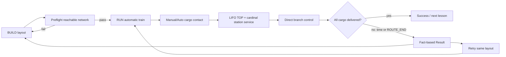
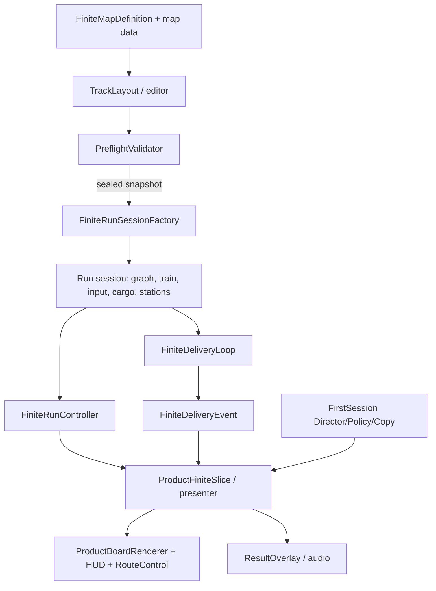

# Switchy Express: Cargo Puzzle — AI Production Specification

> **Document role:** machine-searchable design and implementation contract. It does not replace source code, map data, tests, or human play evidence.
>
> **Canon snapshot:** `origin/main` / `9c3be67cf99221d5007f0332be6935e81a6954bb` (`2026-08-28 KST`)
> **Working branch:** `codex/master-gdd-20260828`
> **Generated:** `2026-08-28 KST`
> **Evidence vocabulary:** `DOCUMENTED`, `CONFIRMED`, `IMPLEMENTED`, `AUTOMATED_TEST_PASS`, `RUNTIME_VERIFIED`, `UX_VERIFIED`, `RELEASE_READY`. A later state never follows from an earlier state automatically.

## 00. CANON SNAPSHOT

### Product identity

`Switchy Express: Cargo Puzzle` is a handcrafted, finite delivery puzzle for Godot 4.7. The player draws a rail layout, using it to determine cargo encounter order; then an automatic train executes that layout while the player chooses cargo loading and operates route controls. The core distinction is that **route design is also LIFO stack-order design**.

```text
BUILD a reachable rail route
→ predict encounter order
→ manually load or enable/disable Auto
→ maintain the desired TOP cargo
→ select a branch before it is occupied
→ pass a station's cardinal service cell
→ observe success or factual failure state
→ Retry same layout or Edit the layout
```

### Authority and guardrails

| Rule | Current contract |
|---|---|
| Product baseline | `GMB-002`, amended by `SX-DEC-060` |
| Active visual planning | `SX-DEC-061`, `SX-DEC-062`, `SX-DEC-063`, `SX-DEC-064` |
| Engine/language | Godot `4.7`, GDScript |
| Current runtime composition | `SX-DEC-062` merged main by PR #237; existing-asset composition only |
| New visual bytes | `SX-DEC-063` user-promoted terrain v02 is Git-tracked with a local manifest and Godot import descriptor; no current runtime/Scene/Resource connection |
| Protected scope | T2 lesson hero v02 / Issue #227, PR #174, Base pin, finite rules, score/economy/progression, audio and locales |
| Image workflow amendment | User instruction, 2026-08-28: actual-consumer candidates may be generated and machine-reviewed before a user decision; only **promotion as a project asset** requires user confirmation. Generation is never runtime proof or integration permission. |

## 01. SOURCE REGISTRY

| ID | Source | Role / status |
|---|---|---|
| SRC-001 | `AGENTS.md`, `PROJECT_TOTAL_PLANNING_IMPLEMENTATION_AND_DELIVERY_INSTRUCTION_v4.8_SWITCHY_ADAPTER.md` | workflow and authority constraints |
| SRC-002 | `기획서/00_프로젝트_허브/ACTIVE_CONTEXT.md`, `CURRENT_CONFIRMED_DECISIONS.md`, `FINITE_DELIVERY_PUZZLE_BASELINE.md` | current product promise and evidence ceiling |
| SRC-003 | `docs/decisions/SX_DEC_060_CARDINAL_STATION_SERVICE_AND_REACHABLE_NETWORK.md` | cardinal service and reachable-network rule |
| SRC-004 | `docs/decisions/SX_DEC_061_BOARD_FIRST_COZY_NEO_ARCADE_VISUAL_REFINEMENT.md`, `SX_DEC_062_BOARD_FIRST_RUNTIME_COMPOSITION.md`, `SX_DEC_063_HYBRID_MINIATURE_DIORAMA_VISUAL_PRODUCTION_ALIGNMENT.md` | visual direction and implementation boundaries |
| SRC-005 | `game/finite/**`, `game/demo/**`, `game/first_session/**`, `game/station/station.gd`, `game/train/train_controller.gd` | actual code and scene ownership |
| SRC-006 | `tests/run_tests.gd`, `tests/finite/**`, `tests/first_session/**`, `tests/demo/**` | deterministic regression contract |
| SRC-007 | `art/product_assets/ed_hybrid_v1/manifest.json`, `docs/ASSET_RIGHTS_AND_PROVENANCE_RECORD.md` | runtime visual consumers and rights/provenance policy |
| SRC-008 | GitHub PR #174 | `DRAFT · READ_ONLY`, not incorporated |
| SRC-009 | Official product/store material, researched 2026-08-28 | benchmark only; no product identity is copied |
| SRC-010 | `docs/migrations/2026-08-28-notion-current-workspace-migration.md` | one-time source-to-GitHub migration receipt; Notion no longer active |

### Benchmark registry

| Ref | Observation | Decision | Switchy translation / non-copy boundary |
|---|---|---|---|
| BMK-001 Railbound — [Steam](https://store.steampowered.com/app/1967510/Railbound/) | Small rail puzzles make each placement legible. | **ADAPT** | Hand-authored compact puzzles and clear route consequences; do not copy its levels, art, characters, or presentation. |
| BMK-002 Train Valley — [Steam](https://store.steampowered.com/app/353640/Train_Valley/) | Routing under active movement makes rail choices feel consequential. | **ADAPT** | One readable live branch decision after planning; reject its throughput/production framing. |
| BMK-003 Station to Station — [Steam](https://store.steampowered.com/app/2272400/Station_to_Station/) | Cozy miniature world improves approachability but can hide constraints. | **ADAPT** | Warm miniature material and calm backdrop; protect grid, station service cells, cargo and route contrast. |
| BMK-004 Rail Route — [Steam](https://store.steampowered.com/app/1124180/Rail_Route/) | Deep dispatch systems support a complex simulation audience. | **REJECT** for this slice | Do not add schedules, automation networks, maintenance, economy, or disruptions. |
| BMK-005 Unrailed! — [Steam](https://store.steampowered.com/app/1016920/Unrailed/) | Immediate collaborative pressure is a strong rail fantasy, but it is a different product loop. | **REJECT** | Preserve solo finite planning rather than real-time resource chaos or co-op. |
| BMK-006 Mini Motorways — [Steam](https://store.steampowered.com/app/1127500/Mini_Motorways/) | Simple network marks and progressive disclosure make systems learnable. | **ADAPT** | One new concept per T1–T6 lesson and redundant state cues; reject endless growth pressure. |
| BMK-007 A Little to the Left — [Steam](https://store.steampowered.com/app/1629520/A_Little_to_the_Left/) | A calm presentation can still support a precise spatial puzzle. | **ADAPT** | Calm world / exact feedback balance; no household-object content or inferred interaction patterns. |

**Differentiation:** Switchy’s meaningful question is not merely “where can I connect rail?” but “what cargo will be on TOP when the train passes this one-tile service cell?”

**Remaining uncertainty:** market fit, retention, price, accessibility comprehension, device performance and player preference remain unvalidated. No current benchmark authorizes a new system.

## 02. CURRENT PROJECT STATE

| Area | Confirmed state | Evidence ceiling |
|---|---|---|
| Finite puzzle semantics | `IMPLEMENTED · AUTOMATED_TEST_PASS` | SX-DEC-060 main merge: 111 cases / 13,461 assertions historical exact run; later SX-DEC-062 documentation records 112 cases / 13,512 assertions. Re-run exact current head before a release claim. |
| Board-first existing-asset composition | `IMPLEMENTED · AUTOMATED_TEST_PASS` | PR #237 / `main@8bce715…`; human/device/audio evidence remains `NOT_RUN`. |
| First session T1–T6 + capstone | `IMPLEMENTED · AUTOMATED_TEST_PASS` | code + test registry; comprehension remains `NOT_RUN`. |
| Runtime art | Existing 79 tracked product PNGs; renderer has 14 board visual paths | loaded/runtime composition is not UX verification. |
| SX-VIS-063-CANDIDATE-001 | `GENERATED_CANDIDATE · REVIEW_PENDING` | 1672×941 RGB, SHA-256 `1b8cdeda06a940e70bf462e0e59b71e4130eeb1b266f606d7cd484ab5d145d0d`; held outside the repository pending final asset decision. |
| Windows / Android / audio / five-person / player experience | `NOT_RUN` for current candidate | cannot be inferred from CI, package, screenshot, or asset existence. |

## 03. CONFIRMED DECISIONS

| DEC ID | Decision | State |
|---|---|---|
| DEC-SX-027 | Finite handcrafted delivery puzzle | CONFIRMED |
| DEC-SX-028 | Free rail build with cost/full refund | CONFIRMED |
| DEC-SX-030 | Straight, curve, switch, crossing | CONFIRMED |
| DEC-SX-031 | Manual default, Auto toggle, unlimited LIFO, matching TOP-group unload | CONFIRMED |
| DEC-SX-041 | `ROUTE_END` failure | IMPLEMENTED |
| DEC-SX-042 | Direct route control with occupied lock | IMPLEMENTED |
| DEC-SX-059 | T1→T6→VS_DEMO_01 first-session sequence | IMPLEMENTED |
| DEC-SX-060 | Cargo exact-cell contact; off-track station cardinal-adjacent service; start-reachable preflight | IMPLEMENTED |
| DEC-SX-061 | Board-first cozy neo-arcade visual grammar | DOCUMENTED |
| DEC-SX-062 | Existing-asset board-first runtime composition | IMPLEMENTED |
| DEC-SX-063 | Rectangular-grid Hybrid Miniature-Diorama alignment | CONFIRMED / planning current |

## 04. DESIGN PILLARS

1. **Route is stack design.** Build order creates later load order, therefore a spatial choice becomes a delivery-order choice.
2. **Small state, readable consequence.** Cargo color/shape/text, TOP, route selection, lock and cardinal service must remain visible at gameplay scale.
3. **Automation is a trade-off, not a solution.** Auto removes repetitive input only in safe segments; the player disables it where selection matters.
4. **Failure is a new attempt prompt.** A result reports runtime facts then offers the same-layout Retry or Edit, never a hidden solver.
5. **Cozy surface, precise puzzle.** The warm miniature world supports concentration; it never obscures the rectangular grid or rule state.

## 05. PLAYER EXPERIENCE CONTRACT

| Moment | Player contract | Observable proof |
|---|---|---|
| Title / first click | “I will make a little railway plan and see it run.” | Title → briefing → board enters without unrelated meta loop. |
| T1–T2 | “My rail connects cargo contact to a station’s adjacent service tile.” | Valid/invalid build feedback, manual pickup and cardinal delivery. |
| T3 | “I must build backward from the cargo that needs to be TOP.” | Changing route encounter order changes resulting unload order. |
| T4–T5 | “Loading now is not always good; convenience can harm a plan.” | A skip/revisit and Auto on/off decision change success possibility. |
| T6 | “My planned route still needs one deliberate live commitment.” | Player changes unoccupied switch; occupied switch communicates lock. |
| Result | “I understand the factual outcome and know whether to retry or edit.” | Runtime-truth result with remaining map cargo and stack size. |

## 06. CORE / SESSION / META LOOP



| Loop | Contract | State |
|---|---|---|
| Core | Build → validate → run → load/route → unload → result | IMPLEMENTED |
| Session | T1, T2, T3, T4, T5, T6, `VS_DEMO_01`, result recovery | IMPLEMENTED / UX not verified |
| Meta | Cosmetic-only progression boundary | CONFIRMED; no active campaign/economy progression implementation is claimed |

## 07. SYSTEM REGISTRY

| ID | System | Player value | Owner(s) | State |
|---|---|---|---|---|
| SYS-001 | Finite map and build layout | Makes route design tangible | `game/finite/map/*`, `game/finite/build/*` | IMPLEMENTED |
| SYS-002 | Reachable preflight | Prevents dead layouts while allowing irrelevant islands | `preflight_validator.gd` | IMPLEMENTED |
| SYS-003 | Automatic run session | Turns a committed plan into observable movement | `finite_run_session_factory.gd`, `finite_run_controller.gd`, `train_controller.gd` | IMPLEMENTED |
| SYS-004 | Cargo / LIFO | Makes encounter order a planning cost | `fixed_cargo_field.gd`, `unlimited_cargo_stack.gd`, `finite_delivery_loop.gd` | IMPLEMENTED |
| SYS-005 | Station service | Converts TOP into a spatial delivery test | `station.gd`, `finite_delivery_loop.gd` | IMPLEMENTED |
| SYS-006 | Route control | Adds one visible live commitment | `finite_track_graph.gd`, `route_control_overlay.gd` | IMPLEMENTED |
| SYS-007 | First-session direction | Reveals one concept at a time | `game/first_session/*` | IMPLEMENTED |
| SYS-008 | Board/HUD/shell presentation | Makes state readable without changing rules | `game/demo/presentation/*` | IMPLEMENTED; UX unverified |
| SYS-009 | Result/recovery | Supports learning and retry | `finite_slice_presenter.gd`, result overlay/shell | IMPLEMENTED |
| SYS-010 | Audio feedback | SFX/music response to states | `game/demo/audio/demo_audio_director.gd` | IMPLEMENTED surface; perceptual QA not run |

## 08. SYSTEM SPECIFICATIONS

### SYS-001 — Finite map and build layout

**Why:** The player needs a finite, authored space in which every placed rail can change future cargo order. **Entry:** BUILD state with a valid map definition. **Input:** tool select, rotation, primary place, secondary remove/clear. **Exit:** sealed snapshot only after preflight passes. **Failure/recovery:** invalid/blocked/forbidden cells remain clear; change or refund rail rather than silently mutating the rules.

| Data contract | Type / owner |
|---|---|
| `board_size`, `start_cell`, `incoming_cell` | finite map definition / `Vector2i`-compatible values |
| `cargo_placements`, `station_placements` | finite map definition / placement dictionaries |
| `fixed_track_pieces`, build layout pieces | map definition / layout owner |
| `ruleset_version`, `definition_identity`, `layout_signature` | sealed snapshot identity guard |

**Implementation:** `game/finite/map/finite_map_definition.gd` owns valid map data; `game/finite/build/track_layout*.gd` owns mutable layout; `game/finite/run/finite_run_session_factory.gd::configure` duplicates and validates the sealed definition/layout before an attempt exists. Do not replace these with an editor-only object or a solver.

**Acceptance:** valid one-cell input maps to the intended rectangular cell; station footprint remains rail-forbidden; retry validates the same layout identity; tests in `tests/finite/build/*`, `tests/finite/map/*`, and `tests/finite/integration/test_finite_sealed_snapshot.gd` stay green.

### SYS-002 — Reachable preflight

**Why:** The player should be told whether the runnable part of a design reaches every required pickup and station service opportunity without being punished for an irrelevant disconnected rail island. **Process:** construct graph → search from start/incoming state → require every cargo cell and at least one cardinal service cell per station → validate reciprocal ports, crossings, switch exits and permanent traps.

| State / result | Meaning |
|---|---|
| `PASS` | Start-reachable RUN component covers required cargo/service range. |
| `UNREACHABLE_CARGO` | Required cargo cell has no reachable path. |
| `UNREACHABLE_STATION_SERVICE` | No reachable UP/RIGHT/DOWN/LEFT service cell for an off-track station. |
| structural failure | Start, dangling, crossing, switch or trap violation; board provides problem-cell evidence. |

**Owner/API:** `game/finite/build/preflight_validator.gd::validate(definition, layout)` returns a preflight result; its reachable-state search is the authority. **No false claim:** preflight proves structural reachability, not an optimal delivery solution or player comprehension.

### SYS-003 — Automatic train run

**Why:** A plan must become a visible consequence. **Entry:** a preflight-passing sealed snapshot. **Process:** factory creates independent definition/layout, graph, stations, cargo field, unlimited stack, input state, train, delivery loop and run controller. **Exit:** all required cargo delivered, time expiry or `ROUTE_END`. **Recovery:** Retry creates a fresh attempt preserving exact solution identity; Edit returns to BUILD.

**Owner/API:** `FiniteRunSessionFactory.configure`, `create_attempt`, `retry`; `FiniteRunController`; `TrainController`. The session factory rejects reused/invalid identity and incomplete configuration. This is a key protection against a Retry silently changing the puzzle.

### SYS-004 — Cargo and LIFO TOP

**Why:** Each cargo contact is a meaningful commitment. **Rule:** manual is default; Auto is an explicit toggle. Contact can pick cargo only when current input says to load. `UnlimitedCargoStack.push` has no capacity limit; `peek` defines TOP; `pop_matching_group` removes only a contiguous TOP group that matches the station type. **Feedback:** compact world token plus Stack HUD; exact count/order belongs to HUD, not a long wagon chain.

**Failure/recovery:** a nonmatching TOP does not fabricate a causal explanation. The factual result surface reports the known remaining map cargo and stack size; the player changes route or input next time.

### SYS-005 — Cardinal station service

**Why:** Station placement makes the final TOP test spatially legible without occupying track geometry. **Rule:** cargo pickup is exact cell contact; station delivery occurs only where `abs(train_x-station_x)+abs(train_y-station_y)==1`. Diagonal cells and station footprint never deliver; overlapping station service fails closed.

**Owner:** `game/station/station.gd`, `FiniteDeliveryLoop.handle_cell_entered`, `FiniteMapDefinition.station_service_cells_for_placement`. **Signal/event:** `FiniteDeliveryLoop.delivery_event_created(event)` exposes a delivery event to downstream presentation; do not invent station-mismatch history not present in current summary/event data.

### SYS-006 — Direct route control

**Why:** Build-time planning remains active while a train is moving, and the player must immediately see where the train will go under the current setting. **Input:** player selects a legal direct switch/crossing route before occupancy. **Rule:** selected direction persists; a train occupying the control makes it locked; no auto-reset, hidden timer or reflex gate. **Visible states:** only the train's current deterministic forward rail route is lime-lit with a direction cue; an alternate remains a dim direct-control target but has no rail light; lock is a separate crimson prohibition overlay on the selected rail; SUCCESS/FAILURE shows no predictive future-route light. The projection roots at actual `train_cell + train_previous_cell`, with authored start/incoming only before train state exists. It reads the current route-control selection and is not an optimal-route solver.

**Owners:** `game/finite/rail/finite_track_graph.gd`, `game/demo/presentation/route_control_overlay.gd`, `ProductBoardRenderer` route visual descriptors. **Test surface:** `tests/finite/rail/test_interactive_route_controls.gd`, `tests/demo/test_route_control_runtime_ui.gd`, `tests/demo/test_product_board_route_clarity.gd`.

### SYS-007 — First session

**Why:** The game’s hook is too interdependent to expose all at once. **Owner chain:** `FirstSessionDefinition` → `FirstSessionStagePolicy` → `FirstSessionDirector` → `FirstSessionCopy`, converging in the product slice/flow controller. **Rule:** hidden commands are disabled on every input route; a lesson may add one concept but cannot create a tutorial-only rule.

### SYS-008 / SYS-009 / SYS-010 — Presentation, result, audio

`ProductBoardRenderer` is the first visual authority: terrain → grid → fixed/build rail → service → route → markers → state → train. `ProductShellArt` owns orientation images only; live state remains domain-owned. Result may state only `ROUTE_END` or time expiry plus known remaining-map-cargo/stack values. `DemoAudioDirector` is the current audio trigger owner, but no post-current-candidate perceptual pass exists.

## 09. CONTENT REGISTRY

| ID | Content | Learning/experience | System dependency | State |
|---|---|---|---|---|
| CNT-T1 | Track Connection | Make a runnable connected route | SYS-001/002 | IMPLEMENTED |
| CNT-T2 | Cargo + cardinal service | Manual exact-cell load then adjacent delivery | SYS-003/004/005 | IMPLEMENTED |
| CNT-T3 | LIFO reverse plan | Build backwards from desired TOP | SYS-001/004/005 | IMPLEMENTED |
| CNT-T4 | Selective non-load + revisit | “Not loading now” can be the plan | SYS-004 | IMPLEMENTED |
| CNT-T5 | Safe Auto / deliberate Off | Convenience versus control | SYS-004 | IMPLEMENTED |
| CNT-T6 | Switch execution | Commit a route before occupancy | SYS-006 | IMPLEMENTED |
| CNT-VS01 | `VS_DEMO_01` capstone | Combine all decisions and recovery | SYS-001–009 | IMPLEMENTED; player experience unverified |

## 10. CONTENT SPECIFICATIONS

| Content | Entry / choice | Success / failure learning | Required presentation | Tests / remaining work |
|---|---|---|---|---|
| T1 | BUILD only; choose straight/curve/rotation to connect start, cargo, service range | preflight pass; no RUN yet | grid, start, cargo/station, valid/invalid placement | `test_tutorial_maps_t1_t3.gd`; human clarity not run |
| T2 | Same valid layout; manually load cargo | exact pickup then cardinal service unload; diagonal/footprint excluded | contextual load cue, service cell cue, stack feedback | first-session/e2e tests; T2 v02 hero protected |
| T3 | choose encounter order via layout | desired unload requires reverse load order | TOP emphasis and color/shape/text cargo mapping | T3 map/witness tests; final HUD geometry deferred |
| T4 | choose to skip then revisit cargo | indiscriminate load harms current TOP plan | untouched cargo remains readable, no false failure label | T4 map tests |
| T5 | toggle Auto for safe segment, disable where order matters | Auto is optional convenience, not a superior rule | visible Auto state plus manual parity | T5 map tests |
| T6 | select delivery branch while unoccupied | lock prevents late change; selection persists | selected/alternate/locked redundant cue | T6 map and route-control tests |
| VS_DEMO_01 | full build/run route, load and switch plan | all delivered success or factual time/route-end result | full board + HUD + Result Retry/Edit | exact map test; new physical/human evidence required |

## 11. UI/UX AND INPUT CONTRACT

| ID | Surface | Live information / controls | Visible states |
|---|---|---|---|
| UI-001 | Title | Product promise, start, optional controls | current shell art is orientation only |
| UI-002 | Lesson/briefing | stage objective, one new input, start CTA | compact violet lesson focus; T2 hero v02 is immutable here |
| UI-003 | BUILD/RUN board | rail tool, grid, preflight, train, cargo, station service, Stack TOP, route controls | valid/invalid/selected/alternate/lock via non-color redundancy |
| UI-004 | Result | actual outcome, remaining map cargo, stack size, Retry/Edit/Title | no invented score, economy, trace or causal claim |

Keyboard inputs in `project.godot`: `1–4` tool selection, `R` rotation, primary action/Space, Shift load, `A` Auto, Escape cancel, Enter confirm. Mouse/touch map through `ProductBoardRenderer` to the same rectangular `board_cell_from_local` mapping. The baseline is 1920×1080 viewport with 1280×720 override, canvas-item stretch, and a minimum 48px target contract. Verify 960×540, 1280×720, 1600×900, 1920×1080 and 2560×1080 in any visual integration change.

## 12. VISUAL ASSET CONSUMER MATRIX

| AST ID | Consumer | Current path/size | Status / rule |
|---|---|---|---|
| AST-001 | `ProductBoardRenderer.board_terrain` | runtime: `art/product_assets/ed_hybrid_v1/board/board_terrain_playfield_v01.png`, 1672×941 | v01 remains current runtime asset until Phase 2 |
| AST-001A | planned `ProductBoardRenderer.board_terrain` successor | `art/product_assets/ed_hybrid_v2/board/board_terrain_playfield_v02.png`, 1672×941, SHA `1b8c…45d0d` | SX-VIS-063 user-approved project asset; runtime not connected; Issue #243 |
| AST-002 | train | `core_train_locomotive_blue_normal_v01.png`, 128×96 | current runtime asset |
| AST-003 | four rail forms | v01 64×64 | current runtime assets, rotate/pivot compatibility protected |
| AST-004 | start/route-end markers | v01 64×64 | current runtime assets |
| AST-005 | red/blue/yellow stations | v01 64×64 | off-track object distinction protected |
| AST-006 | red/blue/yellow cargo | v01 64×64 | compact token; HUD owns exact stack order |
| AST-007 | title/lesson/result shells | `ProductShellArt` paths | T2 `shell_lesson_hero_v02.png` and Issue #227 protected |
| AST-008 | SX-VIS-063-CANDIDATE-001 | 1672×941 generated review candidate | `NOT_RUNTIME_PROOF · NOT_APPROVED · NOT_IN_REPO`; promote only after user decision and later implementation contract |

**Visual grammar:** warm toy-scale miniature railway world; rectangular interaction geometry; elevated 3/4 depth inside asset bounds; rounded silhouettes, soft contact shadow, warm upper-left practical light; dark navy/charcoal control deck with restrained brass. Avoid copied layouts, pseudo-text, currency/score/progression symbols, pure-black pixel outlines, or ornament that hides ports/cells/states.

## 13. AUDIO CONSUMER MATRIX

| AUD ID | Consumer | Trigger role | State |
|---|---|---|---|
| AUD-001 | `game/demo/audio/demo_audio_director.gd` | current demo feedback/music orchestration | IMPLEMENTED surface; perceptual verification NOT_RUN |
| AUD-002 | finite semantic event / result presentation | pickup, unload, route/failure feedback as owned by current director | do not add new audio semantics in SX-DEC-063 |

## 14. TECHNICAL ARCHITECTURE



| Layer | Responsibility |
|---|---|
| Domain data | `FiniteMapDefinition`, fixed cargo/station placements, TrackPiece/Graph |
| Validation | `PreflightValidator` structural/reachability result |
| Session | factory creates independent immutable attempt inputs and mutable runtime state |
| Rule execution | train movement, input state, delivery loop, station unload, route selection |
| Presentation convergence | `ProductFiniteSlice`, presenter/controller, board/HUD/overlay/shell/audio |
| Tutorial policy | stage definition/director/policy/copy, sidecar to finite map schema |

## 15. DATA CONTRACTS

| DAT ID | Owner | Key fields / constraints |
|---|---|---|
| DAT-001 | `FiniteMapDefinition` | schema v3, board cells, start/incoming, required cargo, off-track stations, time, fixed tracks; validation errors fail closed |
| DAT-002 | `TrackLayout` / sealed snapshot | pieces, layout signature, definition identity, ruleset version; snapshot must match factory clone |
| DAT-003 | `UnlimitedCargoStack` | ordered `Array[StringName]`; TOP = final element; unlimited; only matching contiguous group unloads |
| DAT-004 | station placement | `cell`, cargo type; service cells are cardinal neighbors only; no overlap |
| DAT-005 | finite run summary | outcome, failure reason, completion time, time limit, remaining map cargo, stack size; evidence ceiling for result copy |
| DAT-006 | first-session sidecar | lesson ID/order, allowed/visible commands, copy; no map-schema reinterpretation |
| DAT-007 | product visual path map | 14 `ProductBoardRenderer` assets; versioned replacement only after promotion/integration contract |

## 16. SCENE MAP

| Scene | Role |
|---|---|
| `game/main/main.tscn` | application entry |
| `game/demo/vertical_slice_demo.tscn` | title → briefing → product slice → result flow |
| `game/demo/product_finite_slice.tscn` | playable finite slice convergence |
| `game/finite/main/finite_slice.tscn` | finite-slice composition |
| `game/finite/presentation/finite_slice_view.tscn` | finite presentation surface |
| `game/demo/presentation/product_hud.tscn` | live HUD/control-deck surface |
| `tools/validation/finite/finite_validation_launcher.tscn` | validation harness |

## 17. SCRIPT RESPONSIBILITY MAP

| Script | Public responsibility |
|---|---|
| `product_board_renderer.gd` | rectangular cell input, layered board rendering, named product visual loading, route/service descriptors |
| `product_finite_slice.gd` | finite product command convergence and current UI/model binding |
| `finite_map_definition.gd` / `finite_map_loader.gd` | validated map schema/data load |
| `preflight_validator.gd` | structural and start-reachable validation |
| `finite_run_session_factory.gd` | independent validated attempts and same-layout retry identity |
| `finite_delivery_loop.gd` | exact pickup / cardinal station unload event creation |
| `unlimited_cargo_stack.gd` | ordered unlimited LIFO stack behavior |
| `first_session_definition.gd`, `first_session_stage_policy.gd`, `first_session_director.gd`, `first_session_copy.gd` | staged tutorial contract |
| `product_shell_art.gd` | orientation image selection only; no live rule authority |
| `demo_audio_director.gd` | current audio presentation triggers |

## 18. SIGNAL AND EVENT FLOW

| Emitter | Signal/event | Receiver/use | Timing |
|---|---|---|---|
| `ProductBoardRenderer` | `cell_primary_requested(cell)`, `cell_secondary_requested(cell)`, `hover_changed(cell)` | product slice/controller input binding | input event |
| `FiniteDeliveryLoop` | `delivery_event_created(event)` | presentation/result/audio consumers through current convergence layer | train cell-entered event |
| route control surface | current route control request/state | finite graph/session then board/HUD | player pre-occupancy action |
| first-session director | stage transition policy/copy | product flow / briefing / command availability | lesson completion |

Payload schemas outside explicitly named domain types remain implementation-owned. Do not add telemetry/trace fields merely to enrich result prose.

## 19. STATE MACHINES

```text
Slice flow: TITLE → BRIEFING → BUILD → PREFLIGHT_PASS → RUNNING
          → {SUCCESS | TIME_EXPIRED | ROUTE_END} → RESULT
          → Retry(same sealed layout) | Edit(BUILD) | Title

Route control: AVAILABLE → SELECTED → OCCUPIED_LOCKED → AVAILABLE_AFTER_PASS
Load mode: MANUAL_DEFAULT ↔ AUTO_ON
Cargo stack: EMPTY → [items…TOP] → matching contiguous pop → EMPTY/remaining
```

All state changes must preserve the current finite rule boundary. A future save/migration owner is not currently implemented as a release-ready persistence contract.

## 20. SAVE/LOAD CONTRACT

`NOT_IMPLEMENTED_AS_CURRENT_RELEASE_CONTRACT`. Current retry creates a fresh runtime from the same sealed solution identity; lesson progress is session-local. Do not claim a durable campaign save, migration, cloud sync, or cross-device persistence. Any future owner must preserve map schema version, layout signature, input/route state and clear migration semantics without mutating historical v2 data.

## 21. IMPLEMENTATION TRACEABILITY

| Experience | System/content | UI/asset | Actual implementation | Evidence |
|---|---|---|---|---|
| Build path determines encounter order | SYS-001, CNT-T1/T3 | UI-003, AST-001–006 | `finite_map_definition`, layout/editor, `ProductBoardRenderer` | finite build/map and board renderer tests |
| Top cargo decides delivery | SYS-004/005, CNT-T2/T3/T4/T5 | Stack HUD, cargo/station assets | `UnlimitedCargoStack`, `FiniteDeliveryLoop`, `Station` | cargo/station/delivery tests |
| Live branch commitment | SYS-006, CNT-T6 | route overlay, state colors/icons | graph + route control overlay + renderer | rail/route visual tests |
| Learning without new rules | SYS-007, CNT-T1–T6 | briefing, contextual cue | first-session definition/policy/director/copy | first-session/demo flow tests |
| Retry/Edit learning | SYS-009, CNT-VS01 | result shell and live text | factory retry, presenter/result UI | solution identity/result summary tests |
| Cozy but precise visual alignment | DEC-SX-061/062/063 | AST-001–008 | current renderer/shell; no candidate integration | assets/CI only; physical/UX NOT_RUN |

## 22. TEST AND QA CONTRACT

| QA ID | Check | Authority / status |
|---|---|---|
| QA-001 | deterministic finite core and map schema | `tests/run_tests.gd`, finite suites |
| QA-002 | preflight cardinal service/reachability | `tests/finite/build/test_preflight_validator.gd`, integration adversarial tests |
| QA-003 | LIFO and station unloading | cargo/station/delivery suites |
| QA-004 | first-session teaching/hidden-command policy | `tests/first_session/*`, `tests/demo/test_first_session_*` |
| QA-005 | board/HUD/route visual contracts | `tests/demo/test_product_board_*`, HUD, semantic asset/runtime suites |
| QA-006 | package/CI | exact-head GitHub checks; package not human evidence |
| QA-007 | candidate image mechanical review | dimensions, PNG integrity, center-area composition, prohibited-object visual inspection, future same-state runtime composite |
| QA-008 | human/game experience | Windows visual/audio, Android, five-person first contact, player experience — all current candidate `NOT_RUN` |

### Required manual gate for any visual promotion

1. Composite the candidate only in the named actual board consumer at the same viewport/state as the current baseline.
2. Check cell hit testing, rail ports, cargo/station contrast, cardinal-service cue, selected/alternate/locked routes, TOP HUD, clipping and crop.
3. Run desktop physical/audio smoke, Android landscape smoke, and first-contact comprehension before release claims.
4. Record failures as cause/evidence/impact, not a generic subjective score.

## 23. VERTICAL SLICE DEFINITION

The active playable slice is `T1 → T2 → T3 → T4 → T5 → T6 → VS_DEMO_01 → Result`. The slice is successful as a planning artifact when it demonstrates the route/stack relationship, one meaningful Auto trade-off, one switch commitment and factual recovery. It is **not** release-ready until physical/device/audio/human/player gates exist on the exact current bytes.

## 24. RISKS AND BLOCKERS

| Risk | Impact | Disposition / next validation |
|---|---|---|
| Terrain and existing object material mismatch | visual direction can feel incoherent | TEST SX-VIS-063 candidate only in actual board composite |
| Dense diorama border hides gameplay | input/readability regression | protect calm center; inspect at target viewports |
| Candidate mistakenly treated as runtime asset | provenance and evidence drift | keep `NOT_RUNTIME_PROOF` until explicit promotion + integration |
| Full rail-sim feature creep | loses pointed fun and scope | REJECT schedules/economy/maintenance/endless systems |
| T2 protected asset accidentally replaced | approved lesson regression | maintain `shell_lesson_hero_v02.png` and Issue #227 boundary |
| Result invents causal information | misleading player feedback | use only current summary/event evidence |
| CI/payload seen as player evidence | release risk | run physical, audio, device and first-contact gates separately |
| Draft PR #174 changes silently absorbed | canon conflict | READ_ONLY; inspect only |

## 25. USER DECISION REQUIRED

1. **SX-VIS-063-CANDIDATE-001 final disposition:** Approve, revise, or reject the generated terrain candidate. Approval still does **not** integrate it; it authorizes local project promotion/provenance and preparation of a later bounded runtime contract.
2. **After the complete candidate family and this GDD are reviewed:** authorize or decline the Phase 2 implementation contract. This is the first point at which Godot paths/manifest/import/runtime bytes may be proposed.

No choice is required for confirmed finite rules, T1–T6 structure, PR #174, or protected T2 shell.

## 26. IMPLEMENTATION QUEUE

1. Review first terrain candidate at board composite scale; decide APPROVE / REVISE / REJECT.
2. If approved, create provenance record and versioned local Git-tracked asset; do not change runtime yet. Notion is retired from the workflow.
3. Produce only remaining proven-consumer candidates with the same visual grammar, reviewing each before promotion.
4. Create a Phase 2 `CODEX_GODOT_PRODUCT_IMPLEMENTATION_HANDOFF` covering selected paths, imports, manifest, renderer integration, tests, package and manual evidence.
5. Implement only that bounded contract using RED-first tests; then new exact package and physical/human gates.

## 27. CHANGE LOG

| Date | Change |
|---|---|
| 2026-08-28 | Initial integrated AI production specification from `origin/main@c20a0b5`; records SX-DEC-063 as planning current and preserves all evidence ceilings. |
| 2026-08-28 | User workflow amendment recorded: generate actual-consumer image candidates before a promotion decision; final asset promotion remains an explicit user decision. |
| 2026-08-28 | `SX-VIS-063-CANDIDATE-001` generated as a review-only 1672×941 terrain candidate; no repository path, runtime integration or approval claim made. |
