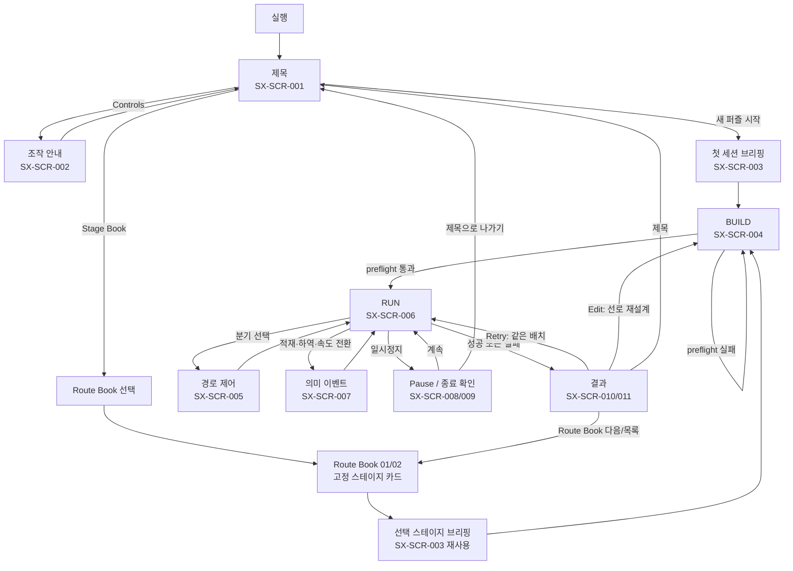
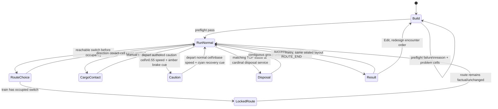

# Switchy Express · Human Game Blueprint r03 Design

**Design ID:** `SX-HGB-001-R03-DESIGN`  
**Status:** `USER_APPROVED_SCOPE_AND_DESIGN · PUBLICATION_PLAN_READY`
**Approved request:** 현재 작업순서에 따라 벤치마킹을 완료하고, 실제 화면·소비처에 맞는 블루프린트(와이어프레임·플로우 맵·UI/이미지 준비도)를 제작한다.  
**Work mode:** `PLAN` — 이 문서는 r03 발행 전 설계 원본이며, 새 게임 규칙·Godot 장면·GDScript·런타임 이미지·Candidate 010 바이트를 변경하지 않는다.

## 1. Goal and current boundary

`SX-HGB-001 r02`를 별도 문서로 복제하지 않는다. 기존 등록 문서인 `docs/design/SWITCHY_EXPRESS_HUMAN_GAME_BLUEPRINT.md`를 향후 `r03`으로 갱신하여, 현재 게임의 제목 → Route Book → 브리핑 → BUILD → RUN → 결과 여정을 사람이 읽을 수 있는 정확한 블루프린트와 파생 PDF로 제공한다.

```yaml
fresh_project_main: 0bf5e2150d643210abf127e34880111ee986b29d
fresh_base_completed_main: 19355b7ef065a21d0f2b685c7d9be64a4a3970f8
current_product_machine_candidate: SX60-POC-ACCEPT-010
candidate_exact_product_source: 79323ff0175b674c594d18dfd6d28a8e9951f5bd
current_blueprint: SX-HGB-001 r02 · USER_APPROVED_DOCUMENT_VISUAL_R02
target_blueprint: SX-HGB-001 r03 · CONTENT_AND_RENDER_REVIEW_REQUIRED
runtime_change_in_this_scope: 0
new_runtime_bitmap_in_this_scope: 0
```

### Protected boundaries

- `GMB-002` finite delivery rules, T1–T6 / `VS_DEMO_01`, Route Book stage IDs, score/progression boundary, and current `0.55` caution multiplier remain unchanged.
- `SX-TITLE-WORDMARK-001` remains the approved, canonical, runtime-connected title wordmark. It is reused as a document input; it is not regenerated or altered.
- Eight Route Book 02 v02 transparent object images remain `GENERATED_CANDIDATE · RUNTIME_CONNECTED · USER_PIXEL_REVIEW_PENDING`. r03 must not promote, replace, or describe them as user-approved pixels.
- Candidate 010 is exact machine package evidence for its recorded source only. Documentation work does not transfer it to human, device, audio, release, or final-user proof.
- PR #254 and Draft PR #174 are pre-existing workstreams and stay read-only.

## 2. Existing solution and reuse-first preflight

| Existing owner or consumer | Reuse decision | Reason |
|---|---|---|
| `SX-HGB-001 r02` source, publication manifest, and PDF builder | `ADAPT` | The existing registered human blueprint and its current PDF pipeline already answer the same human-review question. r03 corrects freshness and adds implementation-aware diagrams instead of creating a second book. |
| `vertical_slice_demo.tscn` and `demo_flow_controller.gd` | `REUSE_AS_FACT_SOURCE` | These own real screen names, actual title/Route Book/briefing/result nodes, and route transitions. The blueprint documents these consumers; it does not recreate them. |
| `ProductBoardRenderer` / `ProductHUD` / route-control and semantic overlays | `REUSE_AS_FACT_SOURCE` | BUILD/RUN boards, route state, speed-transition presentation, TOP, and outcome feedback already have real renderer/HUD consumers. |
| `art/product_assets/ed_hybrid_v2/manifest.json` | `REUSE_AS_ASSET_OWNER` | All current player-facing title and board bitmap slots are assigned. The manifest is the source of path, status, and consumer truth. |
| Existing r02 document visuals | `REUSE_WITH_STATUS_LABEL` | They remain user-approved document visuals only; they are neither runtime captures nor product assets. |
| New raster or UI-image generation | `REJECT_FOR_R03` | No verified unfilled runtime bitmap slot exists. Generating speculative pixels would add provenance and re-verification work without a consumer. |

## 3. Benchmark and reverse-engineering preflight

The study uses current official product pages only. It informs information hierarchy and flow clarity; it does not authorize copying text, art, map arrangements, or game systems.

| Product | Observed pattern | Switchy disposition |
|---|---|---|
| [Mini Metro](https://store.steampowered.com/app/287980/Mini_Metro/) | Network state is compressed into a readable board. | `ADAPT` connection/status readability; `REJECT` endless growth and limited resources. |
| [Railbound](https://store.steampowered.com/app/1967510/Railbound/) | Small authored track puzzles make a single rail relationship legible. | `ADAPT` clear tile/curve connection; retain Switchy's distinct LIFO and direct switch rules. |
| [Train Valley 2](https://store.steampowered.com/app/602320/Train_Valley_2/) | Construction and live operation are visibly separate questions. | `ADAPT` BUILD/RUN distinction; `REJECT` industry, economy, and multi-train management. |
| [Station to Station](https://store.steampowered.com/app/2272400/Station_to_Station/) | A cozy miniature board can remain calm while its active connections stay legible. | `ADAPT` board-first diorama hierarchy; `REJECT` world growth and high-score loops. |
| [Rail Route](https://store.steampowered.com/app/1124180/Rail_Route/) | Current versus alternative routes must be visible at control time. | `ADAPT` route-choice/occupied-lock clarity; `REJECT` automation trees and timetable complexity. |
| [Unrailed!](https://store.steampowered.com/app/1016920/Unrailed/) | Procedural, real-time co-op pressure changes the puzzle into a survival loop. | `REJECT` procedural worlds, co-op chaos, and endless pressure. |
| [Conduct THIS!](https://www.axiom.tools/conductthis/) | Train/switch response should be immediate and explicit. | `ADAPT` branch-state feedback only; `REJECT` collision/reflex-centred play. |
| [Spooky Express](https://store.steampowered.com/app/3352310/Spooky_Express/) | Authored stages can introduce one readable rule at a time within a diorama. | `ADAPT` clear stage purpose and authored progression; `REJECT` its theme and one-passenger restriction. |
| [Cosmic Express](https://store.steampowered.com/app/583270/Cosmic_Express/) | Compact space can make sequence planning the central question. | `ADAPT` order reasoning; `REJECT` capacity-one constraints. |
| [Please Fix The Road](https://store.steampowered.com/app/1383250/Please_Fix_The_Road/) | A narrow per-stage tool/question set improves first reading. | `ADAPT` one named decision per lesson/card; `REJECT` irreversible tool inventory. |
| [Mini Motorways](https://store.steampowered.com/app/1127500/Mini_Motorways/) | A readable network uses redundant visual signals rather than colour alone. | `ADOPT` colour + shape + text redundancy; `REJECT` city growth, upgrades, and daily/endless modes. |

### Reusable conclusion

The r03 blueprint must prioritize four questions before decorative density:

1. Is the next screen and player action obvious?
2. Can the player see the difference between BUILD, valid preflight, and RUN?
3. During RUN, can they distinguish cargo/TOP, direct route choice, and locked route state?
4. Does the result make Retry (same layout) and Edit (new layout) meaningfully different?

## 4. Alternatives and selected structure

| Alternative | Decision | Reason |
|---|---|---|
| A. Correct only r02 wording and cover metadata. | `REJECT` | It leaves current Godot flow, Route Book entry, exact node consumers, and current state vocabulary implicit. |
| B. Create a second standalone wireframe/flow document. | `REJECT` | It duplicates the registered human-blueprint question and creates a second freshness surface. |
| C. Update `SX-HGB-001` to r03 from one implementation-aware design package, then derive its PDF. | `ADOPT` | One registered owner keeps the player journey, flow map, wireframes, asset-readiness matrix, and PDF synchronized while preserving upstream runtime owners. |

## 5. r03 information architecture

### 5.1 Canonical player-flow map



### 5.2 Screen-wireframe contract

| Surface | First attention | Core information | Primary decision | Actual consumer boundary |
|---|---|---|---|---|
| **Title** | approved world wordmark and a single start intent | start, Stage Book, controls, quit | first session versus optional authored book | `TitleScreen`, `TitleLogo`, `StartButton`, `StageBookButton` |
| **Route Book** | book or stage card title | one stage name plus its named decision | which authored puzzle to open | `RouteBookScreen/…/StageList` |
| **Briefing** | lesson/stage title and objective | only the rule relevant to the next board | begin BUILD | `BriefingScreen`, `LessonArt`, `Objective`, `Rules`, `BeginButton` |
| **BUILD** | board and preflight state | buildable/blocked cells, cargo, stations, track tools, reasoned failure | make a run-reachable route and choose encounter order | `ProductFiniteSlice`, `ProductBoardRenderer`, `ProductHUD` |
| **RUN** | train, route, TOP, and active input state | manual/auto, stack TOP, remaining time, branch state, semantic feedback | load, withhold, change allowed switch before lock | `ProductFiniteSlice`, `ProductHUD`, `RouteControlOverlay`, `SemanticEventOverlay` |
| **Result** | success/failure fact and concise reason | delivery/result evidence, remaining consequence, next actions | retry same hypothesis, edit route, or leave/select next stage | `ResultOverlay`, `RetryButton`, `EditButton`, `TitleButton`, Route Book actions |

### 5.3 Low-fidelity wireframes

All wireframes are text-native layout contracts, not replacement screenshots or generated UI art.

```text
[ TITLE ]                         [ ROUTE BOOK ]
┌──────────────────────────────┐  ┌──────────────────────────────┐
│ world wordmark                │  │ choose book / choose stage   │
│ finite rail-puzzle promise    │  │ ──────────────────────────── │
│ [ Start first session ]       │  │ [ card: name + one question ]│
│                               │  │ [ card: name + one question ]│
│ [ Stage Book ] [ Controls ]   │  │ [ Back ]                      │
└──────────────────────────────┘  └──────────────────────────────┘

[ BRIEFING ]                     [ BUILD ]
┌──────────────────────────────┐  ┌──────────────────────────────┐
│ lesson / stage progress       │  │ tool + preflight + cost       │
│ title                         │  │ ┌──── board / grid ────────┐ │
│ contextual art (existing)     │  │ │ terrain · track · cargo   │ │
│ one objective / one rule      │  │ │ station · service cue      │ │
│ [ Begin BUILD ]               │  │ └──────────────────────────┘ │
└──────────────────────────────┘  │ factual error / [ Start RUN ] │
                                  └──────────────────────────────┘

[ RUN ]                           [ RESULT ]
┌──────────────────────────────┐  ┌──────────────────────────────┐
│ time · Manual/Auto · TOP      │  │ success or failure fact       │
│ ┌──── board / active route ┐ │  │ result reason / remaining      │
│ │ train · branch · cargo    │ │  │ [ Retry ] [ Edit ] [ Title ]  │
│ │ caution / recovery cue    │ │  │ [ Stage Book ] [ Next ]*      │
│ └──────────────────────────┘ │  └──────────────────────────────┘
│ route choice / event feedback │  * Route Book run only
└──────────────────────────────┘
```

### 5.4 RUN state and presentation map



The caution entry and recovery cues are presentation-only `ProductBoardRenderer` behavior. They do not write speed, cargo, map, route, or save state. In reduced-motion mode, their equivalent is static and bounded.

## 6. UI and image-readiness matrix

| Surface / concern | Existing source | r03 disposition | Image action |
|---|---|---|---|
| Title identity | `SX-TITLE-WORDMARK-001` → `TitleScreen/…/TitleLogo` | show as the actual approved title identity in the wireframe/PDF | reuse only |
| Title, briefing, result atmosphere | `ProductShellArt` and existing shell assets | describe the composition and leave text/actions as Godot UI | no new bitmap |
| Board terrain / rails / stations / cargo | `ProductBoardRenderer::PRODUCT_VISUAL_ASSET_PATHS` | diagram render order and player-reading hierarchy | reuse only |
| Route choice, grid, service cells, preflight, TOP, status text | Godot UI and procedural renderer layers | show their state contract; do not bake live UI text into an image | no new bitmap |
| Caution overlay, waste crate, disposal yard, wayside objects | v02 `ed_hybrid_v2` entries | label exact current candidate/approval state and normal/caution/recovery behavior | do not generate or promote |
| r02 document visuals | `docs/visual-references/human-game-blueprint/r02/` | reuse only with `DOCUMENT_VISUAL_NOT_RUNTIME_CAPTURE` label | no new bitmap |

### Asset-gap rule after r03

If the r03 matrix later proves a real missing runtime slot, the next task must record one exact `screen → node/key/path → purpose → required state family → provenance → validation` contract. Only then may it create **one** bounded image candidate. Candidate generation, user pixel approval, canonical registration, runtime connection, and runtime verification remain separate states.

## 7. Intended r03 publication change set — not yet executed

| Path | Intended change after design review | Why |
|---|---|---|
| `docs/design/SWITCHY_EXPRESS_HUMAN_GAME_BLUEPRINT.md` | r02 → r03 editorial refresh with the flow map, wireframes, current Route Book, current title identity, RUN state map, and asset-state labels | registered owner of the human-review question |
| `docs/design/SWITCHY_EXPRESS_HUMAN_GAME_BLUEPRINT_PUBLICATION_MANIFEST.json` | update source commit/hash, revision, asset inputs, output path/hash/page count after the PDF is actually built | traceable derived-view provenance |
| `tools/build_human_game_blueprint.py` | update only if its structured data/rendering does not support r03’s existing-source diagrams or exact title wordmark input | preserve the existing generator rather than hand-authoring a divergent PDF |
| `output/pdf/switchy-express-cargo-puzzle_HUMAN_GAME_BLUEPRINT_20260901_r03.pdf` | derive after source and renderer validation | human-facing review view; never a runtime asset |

No game source, scene, map, runtime product PNG, Candidate package pointer, or approved asset is an intended path for this task.

## 8. Design review, verification, and rollback

### Required before r03 publication

1. The user approved this design's information hierarchy, screen flow, and no-new-bitmap finding on 2026-09-01 KST.
2. Follow `docs/superpowers/plans/2026-09-01-human-game-blueprint-r03-publication.md` for the exact publication work order.
3. Update the registered human-blueprint source and its manifest in one branch.
4. Run JSON/registry/document-link validation, the project contract validator, and PDF build/render inspection.
5. Perform five full-scope adversarial loops for scope, flow/consumer correctness, asset/provenance state, visual readability, and evidence ceiling.
6. Publish through a normal PR from latest `main`; merge only after exact-head checks and post-merge readback.

### Five design-review loops completed for this source

| Loop | Attack | Result |
|---|---|---|
| 1. Scope | Could a document update smuggle in a new feature, stage, score loop, or first-session change? | `PASS` — r03 documents existing T1–T6, Route Book 01/02, and approved caution/disposal only. |
| 2. Consumer | Could a flow or wireframe describe a screen that has no current Godot consumer? | `PASS` — every primary surface maps to a named current scene/controller/renderer consumer. |
| 3. Asset provenance | Could a document visual or pending v02 cutout be presented as a final runtime asset? | `PASS` — document-only, canonical, and candidate-only states are explicitly separate. |
| 4. Readability | Could the diorama treatment obscure a player decision or turn a wireframe into decorative art? | `PASS` — diagrams lead with player question, status, and action; they remain text-native and editable. |
| 5. Evidence | Could benchmark or machine package evidence be inflated into human/physical/release validation? | `PASS` — each source preserves the current machine-primary and final-user-review boundary. |

### Rollback

This design is documentation-only. A normal Git revert removes the design/registry navigation entries without altering product bytes, assets, Candidate 010, or the r02 PDF. Existing historical and approved document visuals remain preserved.
