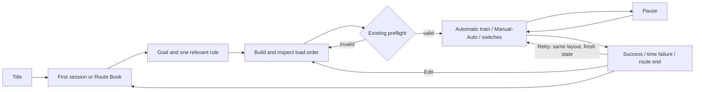

# Core-preserved art and experience replan

Date: 2026-09-10 KST. Work mode: architectural planning and candidate preparation.
Status: RESEARCHED / SPECIFIED; proposed pixels require final user selection.
Authority: user requested core preservation, renewed research and proceeding with the recommendation. This authorizes the night-signal-workshop direction as a working design, not automatic approval of generated pixels.

## Current owner and evidence

Observed project main: `4cbdfc30cf448da8c7fe379b717a9766defe8784`.
Observed Base remote main: `2f93e872d9ed4fa18018ac759b01acd7d34e9b58`.
These are observation receipts, not permanent execution pins. Re-fetch before implementation.
Keep Base v9.4.3 compatibility and v4.8 r5.4 adapter. Project five full-scope reviews remain applicable even when shared guidance uses two.

Current consumers: `game/demo/vertical_slice_demo.tscn`, `game/demo/presentation/product_shell_art.gd`, `game/demo/presentation/product_board_renderer.gd`, `game/demo/presentation/demo_effects.gd`.
Shells currently load v1 hero/lesson/result pictures; the board uses 22 v2/v4 slots. The current cargo marker scale is 0.62, ghost fill alpha 0.08, and caution speed multiplier remains 0.55.
Root checkout has pre-existing import/UID changes and is detached at c62c95e. Work uses an isolated branch from current main. Open PRs #281, #254 and #174 were inspected and remain read-only. Route Book 03 is a separate draft, not implemented content.
Main includes 22 temporary PNGs and 22 import files under tmp/pdfs; export inclusion requires a separate package audit. No deletion is performed by this design.
Candidate 010 remains valid for its own recorded bytes; this document neither invalidates those hashes nor establishes evidence for new artwork.

## Research question and evidence limits

Question: how can the existing route / load-order / timing puzzle become clearer and more distinctive without adding economy, progression or new core rules?
Second pass opened official product pages, developer histories and technical documentation on 2026-09-10. No direct play, video frame analysis, new player study, sales analysis or practitioner interview was performed. Product descriptions are product evidence, not evidence that our players will enjoy an adopted feature. Novelty is a design hypothesis, not a claim that no similar game exists.

| Reference | Source-backed observation | Decision for Switchy |
|---|---|---|
| Trainyard | Multiple solutions and color-blind mode are advertised. [Official](https://www.trainyard.ca/) | ADAPT: preserve expressive routing; reinforce shape and text. REJECT: color mixing. |
| Mini Metro | Network redesign and simple transport concepts underpin its origin. [Developer history](https://dinopoloclub.com/2023/07/05/from-mind-the-gap-to-a-world-of-mini/) | ADAPT: readable network and satisfying small moving parts. REJECT: endless growth pressure. |
| Mini Motorways | The developer describes evolving Mini Metro ideas into road-network play. [Same first-party history](https://dinopoloclub.com/2023/07/05/from-mind-the-gap-to-a-world-of-mini/) | ADAPT: common visual language across world and controls. REJECT: traffic simulation expansion. |
| Train Valley | Track building, switching and timed traffic management; developer attributes color-blind mode to feedback. [Presskit](https://flazm.com/pr-train-valley) | ADAPT: distinguish construction and execution decisions. REJECT: extra simultaneous trains. |
| Train Valley 2 | Authored Company levels combine transport with production and upgrades. [Official](https://store.train-valley.com/) | ADAPT: authored combinations deepen existing verbs. REJECT: production economy and upgrades. |
| Conduct Together | Direct train commands and switches serve action puzzles and co-op. [Official](https://www.conductthis.com/together) | ADAPT: immediate accepted/locked switch feedback. REJECT: co-op and collision escalation. |
| Station to Station | Publisher describes minimalist railway connections in a voxel world. [Publisher page](https://store.steampowered.com/app/2272400/Station_to_Station/) | ADAPT: peripheral environment gives place identity. REJECT: changing engine/render pipeline to voxel 3D. |
| Rail Route | Historical alpha presents dispatching and automation. [Developer alpha page](https://bitrich.itch.io/railroute) | ADAPT: dispatch panel metaphor only. REJECT: automation tree. Historical source; not a current full-feature inventory. |
| Opus Magnum | Open solutions, machinery and animated solution sharing. [Official](https://www.zachtronics.com/opus-magnum/) | ADAPT: make the result of a planned sequence satisfying to watch. REJECT: leaderboards, editor and sharing implementation. |
| Dorfromantik | Tile placement, hand-painted board-game feel and landscape building. [Presskit](https://www.toukana.com/dorfromantik/presskit) | ADAPT: coherent regional materials. REJECT: endless terrain, scores and monthly generation. |
| Factorio | Rail rework jointly addresses geometry, joins, sleepers and related visual consumers. [Developer article](https://www.factorio.com/blog/post/fff-377) | ADAPT: test connected rail families, not isolated beauty shots. REJECT: its extra rail directions and larger geometry. |
| shapez | Official repository identifies an open-source factory/automation game. [Repository](https://github.com/tobspr-games/shapez.io) | ADAPT: inspect explicit transformation/state language as a later reference. REJECT: factory scope. No code-level reverse engineering claimed. |

Railbound remains a prior discovery reference; both official pages returned 403 during this pass. It is excluded from the successful second-pass source count. Twelve games above have source access, with the stated evidence depth limits.

## SWOT translated into action

| Lens | Current condition | Action / expected effect |
|---|---|---|
| Strength / opportunity | Finite route puzzles combine LIFO, selective loading and persistent switches. | SO: make load order and executed route the memorable payoff; stronger identity without new rules. |
| Weakness / opportunity | Art generations and shell/board treatments differ; critical state competes with decoration. | WO: one material language, quiet board, fixed TOP manifest and local feedback; clearer causal reading. |
| Strength / threat | Deterministic rules and authored witnesses provide a stable base, but genre familiarity is high. | ST: differentiate through the interaction of existing choices, then verify machine behavior; avoid unsupported novelty claims. |
| Weakness / threat | Per-image improvisation repeats seam, scale and background problems. | WT: shared rail master, explicit pivots/state family and reduced-motion variants before asset adoption; lower rework cost. |

## Chosen direction and alternatives

Recommended working direction: **야간 신호 공방의 화물 안무**. Player fantasy: a dispatcher arranges rails and loading order, then conducts a small cargo train through a night shift. The title remains Switchy Express. This is presentation, not a new story campaign or job economy.

Compared alternatives:

- Illustrated postal atlas: warm maps and stamps; strong destination identity, but map decoration can resemble playable rail and compete with cardinal geometry. Use restrained paper manifest material only.
- Abstract signal diagram: strongest immediate geometry, economical assets; weaker miniature-world identity. Use its quiet geometry and redundant state symbols inside the selected direction.
- Night signal workshop: concrete rail/cargo materials and local lamps connect world, UI and motion. Select with a brightness floor: night must never obscure the board.

Palette: low-contrast blue-gray board, navy framing, restrained brass mechanics, cream manifest. Cargo color/shape/text remains semantic; brass and cyan must not become ambiguous cargo labels. Light sources are cosmetic and cannot suggest new hazard rules.
Target feeling is deliberate planning followed by a legible sequence of small successful actions. Enjoyment and first-impression effectiveness remain final-user-review questions.

## Keep / improve / remove from future design

| Element | Disposition | Reason and effect |
|---|---|---|
| Finite maps, cost/full refund, automatic train, Manual default and Auto toggle | KEEP | Preserve established planning and execution choices. |
| Unlimited LIFO, matching contiguous TOP unloading | AMPLIFY presentation | Manifest explicitly marks TOP and the current group; do not cap or change the stack. |
| Cardinal station service and exact-cell pickup | KEEP + clarify | Station docking cues remain beside track; no diagonal service or station-on-track drawing. |
| Occupied switch lock | KEEP + local accepted/locked feedback | Prevents visual action from suggesting a rejected route change succeeded. |
| Caution 0.55 and disposal-only waste | KEEP + redraw | Existing optional authored hazards support selective loading; no random traps or new speed rules. |
| T1–T6, capstone, Route Books 01/02 | KEEP structure | Improve lesson/region presentation around existing stage IDs and witnesses. |
| Existing images | REFERENCE for new production | Preserve provenance and current consumers until approved replacements are registered. |
| Whole-board build pulse / HUD-wide unload flash | REPLACE in implementation plan | Local action feedback better identifies cause and avoids moving unrelated information. |
| Terrain baked into object rectangles, oversized cargo, independently improvised rails | REMOVE from new briefs | Repeated user-reported visibility and continuity failures. No historical file deletion implied. |
| Fuel, boost, cargo-capacity limit, score, upgrade economy, procedural content | REJECT | Change scope or distract from the preserved core. |

## Editable flow and wireframes



Retry routing must follow the actual session controller, including its existing checks; this diagram does not authorize skipping validation. No new mid-run editor or solution reveal.

1280×720 design target; reflow at supported viewport sizes, preserve the existing rectangular grid and input mapping.

```text
TITLE
+-----------------------------------------------------------+
| SWITCHY EXPRESS                quiet workshop hero         |
| Short finite-puzzle promise    train and signal details    |
| [Start]                        outside text safe area       |
| [Stage Book] [Controls] [Quit]                              |
+-----------------------------------------------------------+

BUILD / RUN
+-----------------------------------------------------------+
| Stage / concise objective                    Time / Pause |
+-----------------------------------------+-----------------+
|                                         | CARGO MANIFEST  |
|                  BOARD                  | TOP / group     |
| quiet terrain; clear rails and tokens   | remaining stack |
| scenery outside playable connections    | station goals   |
|                                         | Manual / Auto   |
+-----------------------------------------+-----------------+
| BUILD: piece / rotate / remove / RUN                      |
| RUN: current action / accepted or locked local feedback    |
+-----------------------------------------------------------+

RESULT
+-----------------------------------------------------------+
| outcome and existing reason                               |
| compact completed/remaining delivery summary              |
| [Retry same layout]  [Edit layout]  [Stage Book]            |
+-----------------------------------------------------------+
```

Manifest grouping is a view of current state, never a predicted optimal solution. Keep time and input labels as real localized Godot text, not painted into art. Result copy must only name reasons exposed by existing runtime data.

## Asset and motion production contract

| Family / existing consumer | New preparation | Motion and stop behavior |
|---|---|---|
| TitleBackdrop / ProductShellArt TITLE | Text-free workshop hero; title wordmark separate transparent asset | Very restrained ambient detail; static equivalent. |
| ProductBoardRenderer terrain / five decoration slots | Quiet terrain plus separate object-only RGBA decoration families | Static by default; no continuous distracting loops. |
| Four rail slots | Connected master covers straight–curve, S pair, crossing and switch; cut on shared cell origins | Active branch and occupied lock follow actual state, never decorative branch changes. |
| Train / cargo / four stations | Consistent scale and pivot; cargo retains redundant IDs; stations remain off-track | Load/unload start only after confirmed semantic event. |
| Caution and speed presentation | Object-only caution; amber inward brake and cyan forward recovery | Trigger once at boundary; recovery means normal speed, not BOOST. |
| Lesson / Result shells | Reuse chosen material language with distinct relevant compositions | No motion completion callback may mutate game results. |

Aseprite automatic choice: use the restricted local candidate workflow for frame sequences, aligned layered sprites and PNG+JSON packing; use the image model for original pixels. Large static hero paintings do not require sprite-sheet conversion. An imported single image is not an animation.
Keep .aseprite editable source when used. Stage only copies in a unique task directory under the configured candidate root. Record original/export hashes, tool version, dimensions, frame count, durations, padding, layer/tag data, pivot and consumer. Export to fresh filenames. Do not assume trimming preserves pivot without checking the metadata. [Sprite sheets](https://www.aseprite.org/docs/sprite-sheet/) and [slices](https://www.aseprite.org/docs/slices/) are the technical references.

Rail invariants: existing 64×64 logical cell contract, four edge-center ports, consistent gauge, endpoint tangent direction, rotation mapping and sleeper continuity. Review the entire joined sheet before and after extraction at game scale and non-square viewport scaling. The image model cannot guarantee exact geometry; failed joins require correction before registration, not hiding seams with glow.

Proposed action timing (presentation targets, not game timing): placement 120 ms; accepted switch 140 ms; occupied lock static symbol with brief 120 ms emphasis; load/unload 180–240 ms; caution/recovery at current 280 ms envelope. Reduced motion uses static or short opacity cues, no displacement or camera/board scale. Interrupt on Retry/Edit/screen exit; rapid repeats must not accumulate stale animation. No artificial delay to train simulation or inputs.

Production order: review direction sheet → generate rail master and one representative train/cargo/station family → Aseprite frame/pivot/export checks where applicable → final pixel selection → catalog/provenance registration → connect existing consumers → machine and Godot runtime checks → expand remaining families. This prevents a large batch from propagating an unreviewed scale/material error.

## Five-pass design review

Each pass considered core scope, consumers, visual clarity, provenance, import failure and evidence wording; focus/findings are recorded below. These are self-review passes, not independent human review.

1. Scope attack: a dispatcher theme could imply economic jobs or unlocks. Corrected to cosmetic framing; stage IDs/core remain stable. Generated direction pixels remain candidates.
2. Consumer attack: an attractive mockup could invent station-on-track semantics or optimal-route hints. Corrected wireframe/brief to cardinal off-track stations and current-state manifest only; literal topology still requires machine verification.
3. Visibility attack: night lighting, cyan and brass could obscure color codes; global pulses could compete with decisions. Added quiet board, redundant symbols/text and local reduced-motion feedback.
4. Production attack: slicing a beautiful master does not prove edge/tangent continuity, and one-frame exports are not motion. Added before/after joined-grid tests, pivot/metadata readback and explicit frame sequence gate.
5. Evidence/retention attack: old package claims, alpha pages and API discovery could be overstated. Bounded historical sources, preserved Candidate010 exact-byte validity, marked new runtime/animation unrun, and kept unrelated PRs/files intact.

## Verification and remaining work

Design feasibility is supported by existing scene/control/render consumers; implementation, generated-frame fidelity, runtime readability and performance are not yet verified for this replan. No new gameplay code is changed by this package.
Run project contract validation and diff hygiene for this planning change. At implementation, use meaningful existing regression suites plus join/rotation, opacity, transparent-border, state-to-feedback, interruption and reduced-motion checks; launch the exact isolated Godot project and capture title/build/run/result at supported sizes. Machine checks are primary. No five-person comprehension or player-experience study is required; final user review remains separate.

Learning: the recurring failure is independent asset preparation without shared join/pivot/state contracts. Project action is the connected-master and event/asset matrix above. Base promotion is only a proposal after this method has real validated results; no Base files are modified or universal skill created by this planning task.
Rollback: retain current assets/scene paths until approved candidate registration. Reverting the planning commit removes this proposal without changing playable bytes. Temporary images are deletion candidates only after ownership and export audit, not because their names look old.
