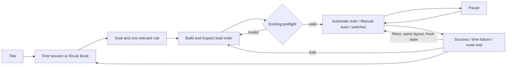

# Core-preserved art and experience replan

Current authority amendment 2026-09-11: user authorized finishing remaining preparation AND game
implementation. Prior planning-only holds below are historical. Selected slate board only is
registered and connected; unselected title and failed-alpha object family remain excluded.
Current bounded execution evidence: SX_DEC_070_NIGHT_WORKSHOP_FIRST_OBJECT_FAMILY.md, September 11 section.

Date: 2026-09-10 KST. Work mode: architectural planning and candidate preparation.
Status: PLANNING_REVIEW_FIRST / PRODUCTION_HELD_BY_USER. Earlier design and production records below are historical where superseded by this amendment.
Authority: user requested core preservation, renewed research and proceeding with the recommendation. This authorizes the night-signal-workshop direction as a working design, not automatic approval of generated pixels.

## Planning-first review amendment — 2026-09-10

Latest user instruction: do not work on images now; first work on planning and review.
Only the blue-gray board pixels were selected. The night-workshop title candidate was not selected.
No new images, image edits, runtime changes, new core mechanics or PR #284 merge are part of this review.
Previously prepared code, candidates and evidence remain preserved. This amendment is a proposal,
not blanket design approval or production resumption authority.

### Review baseline and limits

Later observed main is `4038ff04420bb9b7e385654d09f63161c1e2036b`; the main observation
in the original section below is historical. Review also uses the unmerged SX-DEC-070 worktree.
Screens: `evidence/runtime/night-workshop-20260910/build.png`, `pickup-0.png`,
`pickup-2.png`, `result.png`; surface comparison: `evidence/design/night-workshop-surfaces-20260910/board-preview.png`.
These are machine framebuffer evidence at 1280x720 with a programmatic RB01 witness.
They are not direct player research, full journey coverage, real-time motion quality,
accessibility compliance, final user review or release acceptance.

### Product promise and scope

Working promise: build a route, choose what to load and when, and arrange the TOP cargo group
so a moving train delivers the required cargo. The distinctive design hypothesis is the
combination of spatial routing, reverse load-order planning and direct switch timing.
Neither a new economy nor more decorative props is needed to express that promise.
Retain the finite/LIFO/cardinal-service baseline, current stage IDs and Retry/Edit distinction.
Route Book 03 and other unrelated Draft PRs remain separate.

### Research comparison and work-order choice

Reopened official sources on 2026-09-10:

- [Opus Magnum](https://www.zachtronics.com/opus-magnum/): open-ended machine puzzles support
  multiple solutions. ADAPT the principle of making a player's constructed solution legible;
  REJECT importing optimization rankings, sharing or a new machine-programming system.
- [Factorio FFF-377](https://www.factorio.com/blog/post/fff-377): rail geometry, grid connections,
  graphics layering and connected systems constrain each other. ADAPT geometry-first connected
  family review; REJECT copying its rail topology, scale or extra directions.

These supplement, not replace, the twelve-reference comparison below. They support a design
approach; they do not prove enjoyment or unique market positioning.

| Work order | Benefit | Risk | Decision |
|---|---|---|---|
| Finish all art first | A coherent concept set appears quickly | Wrong scale, state coverage and consumers cause rework | REJECT for this increment |
| Improve isolated runtime defects first | Local problems close quickly | Mixed old/new screens persist without an accepted whole | HOLD while planning is reviewed |
| Screen and state specification → shared contracts → design review → production | Each asset has a tested purpose and integration boundary | More up-front specification | RECOMMENDED; production still held |

### Screen review and proposed refinements

| Flow step / health | Current observation | Proposed action and reason | Expected effect |
|---|---|---|---|
| 1. Build — needs refinement | Current frame combines forest/gold board, old objects and the new blue family | Plan quiet board layers, separate service cells from tracks and reserve selection contrast | Player reads placement and connectivity before decoration |
| 2. Run — needs refinement | Local cargo lift and a large central pickup symbol coexist; TOP text is visible | Assign pickup feedback locally and inventory confirmation to the manifest; specify suppression/priority of global feedback | One event reads as one action rather than competing cues |
| 3. Result — needs refinement | Immediate result frame has a central success effect over the result area | Specify transient effect bounds and a stable readable summary; retain Retry/Edit meanings | Clear outcome and next action without invented scoring |

The immediate result frame does not establish a persistent overlap defect. A stable post-effect
capture is a future verification requirement. Current captures do not establish title, pause,
keyboard, small-viewport or every failure-state usability.

### Editable information layout — proposed, not implemented

```text
BUILD
top: stage / required delivery / current cost and recommended cost (not a hard budget)
center: board (track ports, cargo, stations and cardinal service)
side: selected tool / valid-or-invalid reason / remaining requirements
bottom: build controls / undo-or-refund information / start

RUN
top: remaining time / delivery progress
center: board + local pickup/unload + selected route / occupied lock
side: TOP → contiguous matching group → remaining stack
bottom: Manual pickup / Auto state / Pause

RESULT
outcome + factual cause
delivered / remaining / existing time and cost facts
Retry same layout | Edit layout | stage navigation
```

Do not expose future route solutions, fabricate a best route, add cargo capacity, or imply that
all cargo of the same color anywhere in the stack can unload. A grouped display must follow
the authoritative contiguous TOP group and preserve color + current shape + text identifiers.

### Required state contract before image production

| Screen/state | Required information and action | Invariant / review check |
|---|---|---|
| Build empty / valid / invalid | Placement preview, cost/refund, start eligibility and existing preflight reason | Invalid never looks valid; station footprint cannot receive track |
| Run Manual / Auto | Current mode, accepted pickup, remaining cargo | Manual remains default; presentation cannot trigger pickup |
| Run loaded / unloading | TOP, contiguous group and resulting stack | Unlimited stack is represented without a false capacity limit |
| Run switch selected / occupied | Actual route and locked response | Lock feedback cannot change the route or simulate acceptance |
| Pause / resume | Frozen action state and clear resume control | Domain and visual timeline pause; no duplicated event |
| Success / time failure / ROUTE_END | Distinct factual reason and next actions | No new score or failure rule; result text remains readable |
| Retry / Edit | Same-layout fresh run versus return to editing | No stale lift/selection effect or carried-over run state |

These are planning requirements, not claims that every state has been fully specified or tested.
Next planning pass must map each row to exact existing owner fields, input handling, copy keys,
small-viewport layout and individual acceptance cases before authoring assets.

### Shared asset and motion contracts to settle first

1. Board: approved slate pixels remain unchanged; plan modulation separately. Existing warm veil
   changes the apparent blue-gray color, so a bitmap substitution alone is not a complete design.
2. Rails: one connected master, fixed logical edge ports, shared gauge/bed width, tangent-consistent
   curves, rotations and junction overlap rules. Review the entire assembled route at gameplay scale
   before slicing. The existing master is not yet a verified tile atlas.
3. Objects: common scale, camera, ground contact and facing; station service must read as off-track.
   Do not replace current semantic shapes with a concept-sheet variant.
4. Motion: define preparation/action/recovery and idle alignment; exact event consumer, pause,
   interrupt, Retry/Edit reset and reduced-motion alternative precede sprite-sheet production.
5. Layers: terrain < grid/service < rail < gameplay objects < local state cues < HUD.
   Decoration must not resemble cargo, switch availability or hazards.

### Keep / refine / hold / reject

| Disposition | Element | Reason / expected effect |
|---|---|---|
| KEEP | Core rules, authored current stages, machine-primary evidence | Preserve approved identity and reliable regression |
| REFINE | TOP-group readability, service distinction, feedback priority, result explanation | Improve decisions using existing rules rather than add complexity |
| REFINE | Shared rail ports, pivots, state and palette contracts | Prevent repeated disconnected curves and asset-family drift |
| HOLD | Images, additional runtime changes, PR #284 merge and new package | Respect planning-first instruction and avoid premature production |
| HOLD | New stage content and remaining art families | Map gaps against existing learning sequence before expanding |
| REJECT | Blanket title-candidate adoption, implicit deletion, solver/economy/score expansion | Neither non-selection nor art approval authorizes these changes |

### Five-pass planning review and unresolved gates

1. Scope/identity: kept finite/LIFO/cardinal service; removed production continuation as next action.
2. Consumer/feasibility: tied requirements to existing board/shell/event consumers; no invented new
   panel implementation claim. Exact per-state field/copy mapping remains OPEN.
3. Visual/readability: separated board pixel approval from modulation; identified competing
   feedback and immediate-frame result uncertainty. Responsive and reduced-motion review OPEN.
4. Provenance/recovery: preserved selected board hash, unselected title and prior work; no deletion,
   external pixel reuse, Base promotion or unrelated PR action.
5. Evidence/authority: differentiated local unmerged runtime proof from GitHub main, user selection
   from implementation, and machine observations from UX/release acceptance.

This is a scoped planning review, not five independent human reviews or a production-ready PASS.
Next safe work is the state/owner/copy and viewport specification, then a design readback.
Production remains held until that planning is reviewed and resumption is authorized.

## Delegated detailed planning — 2026-09-10

The user delegated detailed rule/presentation planning to research-backed recommendations.
This authorizes the design decisions below within the retained core, not image production,
code changes, new gameplay semantics or merging PR #284. New numeric values are
RECOMMENDED_DEFAULT, not measured optima or individually user-approved values.
Work mode: architectural planning; project design route plus concept benchmark/analysis.

### Evidence, alternatives and confidence

Fresh project main remains `4038ff04420bb9b7e385654d09f63161c1e2036b`; Base observation
remains `2f93e872d9ed4fa18018ac759b01acd7d34e9b58`. Compatibility is unchanged.
The twelve-game research below is reused evidence, not twelve new play sessions this turn.
Fresh sources for this detail pass:

| Source / observed pattern | Fit and difference | Decision |
|---|---|---|
| [Trainyard official FAQ](https://www.trainyard.ca/solutions/faq): many solutions and finding one's own solution | Preserve route expression, but our cargo order adds another decision axis | ADAPT: preflight explains invalid structure, never presents an optimal route |
| [Opus Magnum](https://www.zachtronics.com/opus-magnum/): open-ended construction puzzles | Designed solutions can be rewarding to observe; our train is not a programmable manipulator | ADAPT: make load-order consequences visible; REJECT rankings/economy/editor expansion |
| [Factorio rail production](https://www.factorio.com/blog/post/fff-377): geometry and connected graphics must agree | Applicable to connected rail families, not its topology or scale | ADAPT: ports/gauge/tangency before tile slicing |
| [Game Accessibility Guidelines](https://gameaccessibilityguidelines.com/give-a-clear-indication-that-interactive-elements-are-interactive/): distinguish interactive elements consistently | Needed because board decoration and controls share space | ADOPT: stable outlines/icons/focus; hover cannot be the only identifier |
| [Godot focus documentation](https://docs.godotengine.org/en/stable/tutorials/ui/gui_navigation.html): explicit focus neighbors and initial focus; separate UI actions from gameplay | Existing Control scenes and DesktopInputAdapter can support this boundary | ADAPT: scene-local focus order and consumed-input routing, without addon replacement |

Player-response evidence remains insufficient: an attempted Mini Motorways community discussion
fetch timed out. Search snippets are not treated as reviewed player evidence. No response-frequency,
enjoyment, sales, accessibility compliance or causal claim is made. Benchmark confidence is limited
to official product facts, professional guidance and current repository behavior.

Three usable information-layout alternatives were compared:

| Alternative | Decision visibility | Board area / cost | Decision |
|---|---|---|---|
| Fixed right manifest | Stable TOP/group location; easy comparison with board | Uses horizontal space | SELECT for normal landscape |
| Bottom horizontal manifest | Preserves width and works on narrower layouts | Competes with load/pause controls; long stacks need scrolling | ADAPT as compact layout fallback |
| Context-only floating cards | Largest unobstructed idle board | Discovery cost and moving targets during timing decisions | REJECT as sole source of essential information |

### Detailed retained rules and player-facing language

| Rule ID | Recommendation / retained meaning | Owner / boundary |
|---|---|---|
| DP-01 | Construction is unrestricted by a hard budget. Show current cost and recommended cost, not remaining money. Exceeding recommendation is not failure. BUILD removal refunds fully. | FiniteBuildSession + presenter current_cost/recommended_cost |
| DP-02 | START depends only on actual preflight. Show its primary reason and problem cells; do not invent an independent UI validator. A valid network is not a guaranteed solution. | FiniteSlicePresenter.show_build; start_enabled, primary_reason, problem_cells |
| DP-03 | Cargo requires train contact with the same cell; hold Manual to load during contact, or enable Auto. Pressing elsewhere does not reserve future cargo. | FiniteGameplayInputState; LOAD_ACTIVE(bool), AUTO_TOGGLE |
| DP-04 | Station service is exactly one cardinal tile away. Station footprint and diagonals never count. Use a distinct service outline, not a rail-looking station base. | SX-DEC-060, Station, map schema v3 |
| DP-05 | Last loaded is TOP. Only a contiguous matching TOP group unloads. No capacity cap or arbitrary stack reordering. | UnlimitedCargoStack + FiniteDeliveryLoop |
| DP-06 | Switch state persists until a valid manual change; an occupied switch stays locked. RUN never allows construction/removal. | FiniteSliceSessionController + authoritative route_controls |
| DP-07 | PAUSED is inspection only. Manual hold clears on pause; Auto setting is preserved but inactive until resume. No queued switch/placement/pickup while paused. | FiniteGameplayInputState.set_paused and controller pause/resume |
| DP-08 | Retry keeps the layout but creates fresh attempt/runtime state. Edit returns the same layout to BUILD and clears transient run state. | FiniteRunSessionFactory; RETRY_SAME_LAYOUT / EDIT_LAYOUT |
| DP-09 | Success, TIME_EXPIRED and ROUTE_END use actual outcome data; do not recompute precedence in the UI. | FiniteRunController summary + presenter.show_result |
| DP-10 | Existing authored caution/waste remain existing content, not permission to add traps, random cargo or change speed rules. Blue recovery cue means return to normal, not player BOOST. | Current map/event consumers; no new hazard schema |

Example: load order bottom→TOP = red, blue, blue. At a blue station the two blue items
can unload, exposing red; at a red station they cannot be bypassed to unload the lower red.
The display must say “TOP 묶음: 파랑 다이아 ×2”, not “파랑 2개 배송 보장”.

### Screen, state, input and focus specification

| Screen | Information order | Main action / input | Exception and focus rule |
|---|---|---|---|
| Title | Existing title identity → start/stage navigation → settings | Existing shell controls only | Keep old approved title while new candidate is unselected; no fake Continue without save support |
| Book selection | Book/stage name → learned rule/theme → existing progress | Select existing stage, back | Keep current availability policy and stage IDs; never imply unimplemented RB13–18 are playable |
| Brief | Delivery objective → one relevant rule → controls → enter BUILD | Enter existing stage; back via shell | No route solution preview; initial focus on primary entry |
| BUILD idle | Stage/objective, current/recommended cost, board, tool selection | BUILD_TOOL, BOARD_CELL, ROTATE, REMOVE, CLEAR, START | No new drag-paint or Undo command assumed; explain current supported operations |
| BUILD invalid | Primary preflight message + identified cells | Edit route | Disabled START remains accompanied by readable reason; decorative islands do not falsely block start |
| RUN | Time/progress, train/route, TOP group, load mode, pause | LOAD_ACTIVE press/release, AUTO_TOGGLE, switch selection/action, PAUSE | No duplicate mouse/keyboard activation; controls never cover interactive rail/service cells |
| UNLOADING | Current committed unload event + remaining presentation | Existing allowed run controls | Animation cannot create delivery or delay success authority |
| PAUSED | Clear pause label, frozen board/stack, Resume | RESUME; current shell navigation only | Modal consumes input; focus stays in visible panel and restores on resume |
| RESULT | Outcome and factual cause → existing time/cost facts → next actions | Retry / Edit / existing stage navigation | Failure emphasizes Retry and Edit without auto-start; stable summary is never obscured by effects |

Desktop gameplay keeps existing `demo_*` actions; no new key bindings are invented here.
Tooltips and shortcut legends should read actual InputMap bindings, not hard-code the displayed key.
UI focus must not reuse gameplay actions. Hidden/disabled controls must not retain navigation focus.
Touch equivalents are explicit buttons/taps; no essential information requires hover.
Press cancellation, pointer release outside the button, application focus loss and modal opening
must release manual intent, preventing unintended persistent loading. This is a required input-safety
acceptance case, not a claim that all cancellation paths currently work.

### Exact data and copy ownership / implementation gaps

| Information | Current source | Planned use / identified gap |
|---|---|---|
| Phase/control availability | game/finite/presentation/finite_slice_presenter.gd: phase, editing_enabled, load_enabled, auto_enabled, pause_visible | Render actual flags plus phase; do not substitute visual-only state |
| Cost and start reason | current_cost, recommended_cost, start_enabled, primary_reason, problem_cells | “현재 건설비 / 권장 기준”; primary error from actual code, fallback “노선을 확인해 주세요” |
| Stack | stack_tokens with cargo_type, index, top; stack_size | Reverse for TOP-first display without mutating stored bottom-first order; group adjacent identical types only |
| Cargo identity | game/cargo/cargo_type.gd | RED_STAR = 빨강·별; BLUE_DIAMOND = 파랑·다이아; YELLOW_TRIANGLE = 노랑·삼각; WASTE_CRATE = 폐기물·상자 |
| HUD cargo names | game/demo/presentation/product_hud.gd:_stack_text | Current two-way label branch maps every non-red to blue. GAP: all authored types need exhaustive labels; unknown type must not silently become blue |
| Remaining delivery | controller render snapshot cargo_placements / delivery_count, authoritative stack and result summary | Presenter.show_run currently assigns remaining_map_cargo=0. GAP: no running progress UI may trust this placeholder |
| Unload presentation | presenter.begin_unload_visual/apply_unload_emissions | Keep visual in-flight stack separate from committed counts; no double-count during animation |
| Board state | game/finite/main/finite_slice_session_controller.gd:_build_render_snapshot | Use actual selected_cell, layout_pieces, route_controls, station/cargo placements |
| Shell/lesson copy | data/localization/first_session_v1.json; route_book_01_v1.json; route_book_02_v1.json | Existing copy families remain owners for those screens |
| Core HUD messages | product_hud.gd hard-coded Korean + presenter.status_text English | GAP: choose one shared HUD localization owner during implementation; do not silently add a nonexistent JSON file now |

Progress definition: “미배송” means ground cargo plus train-carried cargo not yet committed to delivery.
If individual required counts cannot be derived reliably from the current attempt snapshot, omit
the unverified per-type progress row until an authoritative read projection exists. Never display
a default zero as an observed count. Optional derived fields cannot become a second game state.

Proposed short copy:

- Manual: “누르는 동안 적재”; Auto: “자동 적재 켬 / 끔”.
- TOP: “다음 하역 대상”; matching group: “TOP 묶음”; lower stack: “아래 화물”.
- Service: “역의 상하좌우 한 칸에서 하역”; wrong TOP: “이 역과 TOP 화물이 다릅니다”.
- Locked: “열차가 지나가는 동안 변경할 수 없습니다”.
- Retry: “같은 노선으로 다시 운행”; Edit: “노선을 수정”.
- Preflight generic coverage: “필수 화물 또는 역 옆 서비스 칸이 연결되지 않았습니다”.

Only show wrong-TOP/locked messages after a relevant observed contact or rejected action;
do not spam repeated banners every frame or claim to predict future delivery.

### Visual, motion and scale acceptance defaults

These values guide later production; no image or code is changed now.

- Preserve the logical 1920×1080 viewport; current window override is 1280×720.
  Review 1920×1080, 1280×720 and a compact 960×540 render. The compact size is a test case,
  not a new supported-device/release claim.
- Normal landscape uses the right manifest; compact mode uses a bounded bottom manifest above
  controls when the board cannot retain readable cells. Never non-uniformly stretch square rail tiles.
- Reserve primary text at a recommended minimum 18 rendered pixels at 1280×720; secondary 16.
  Interactive controls target at least 48×48 rendered pixels with 8-pixel separation. These are
  project review defaults, not physical dp or accessibility certification.
- TOP and the leading group always stay visible. Show up to six group rows plus an exact overflow
  count, with inspection scrolling for remaining groups; unlimited logical capacity is unchanged.
- Cargo baseline footprint stays near the current 0.62-cell scale until composite evidence supports
  a change. Production sheets must distinguish object silhouette, transparent padding and shadow.
- Rail endpoints are edge-centered in logical tile coordinates. For each valid neighbor/rotation,
  port centers and tangent direction agree; rail gauge/bed widths match. Test assembled straight,
  S curve, four rotations, crossing and T junction at gameplay scale, not only the master preview.
- Hover uses a low-opacity fill and a crisp border rather than whitening the whole tile.
  Selected, invalid and occupied-locked states differ by symbol/line pattern plus text, not color alone.
- Event priority: modal/result readability > actionable lock/error > local delivery/load > ambience.
  Normal pickup/unload never needs a large central icon in addition to the local event and manifest.
- Placement/accepted switch target 120–160 ms; cargo action 180–240 ms; speed transition 240–320 ms.
  These are presentation-only targets, not simulation timing. Use existing event-time authority.
- Reduced motion removes lift/scale pulses and uses brief opacity/static markers. Pause freezes
  presentation; Retry/Edit/result transition cancels stale events; repeated events cannot grow an unbounded queue.
- Audio reinforces accepted placement, pickup, unload and lock, but essential information remains
  available without sound. No new audio production or perceptual PASS is implied.

### Content and worldbuilding disposition

The working fantasy is a dispatcher arranging cargo movement on a workshop board, not a railway
business manager. The slate and local brass/cream material accents support that role; lore text
must not invent a new campaign, characters or title identity during this detail pass.
Existing T1–T6/capstone and RB01–12 stay intact. Review levels by decision demand (connection,
cardinal service, reverse load order, selective pickup, Auto choice, switch timing), not just
map size or prop count. Audit existing caution/waste placement against learned prerequisites
before proposing new levels. No new stage IDs, changed time limits or adaptive difficulty now.

SWOT actions:

- SO: combine route design and TOP-order decisions as the visible identity; make the first successful
  local pickup→stack→delivery chain the meaningful reward, rather than add a currency.
- WO: fix shared identity/copy and state coverage before producing the remaining art families.
- ST: keep authored deterministic outcomes and inspectable Retry/Edit; do not hide rules behind decoration.
- WT: hold new modes, new trap families and decorative overload until the current full flow is coherent.

### Review receipt and future acceptance cases

Five sequential full-scope self-review passes, not independent agents or human UX tests:

1. Core/scope: removed the earlier wireframe's ambiguous budget wording; DP-01 explicitly keeps cost advisory.
2. Consumer/data: found two-color HUD fallthrough and zero-valued running cargo field; recorded as implementation
   gaps instead of treating them as usable facts. Yellow identity corrected to TRIANGLE from actual source.
3. Input/flow: preserved hold-to-load, pause inspection and fresh Retry; added release/cancellation and modal focus cases.
4. Visual/provenance: retained board-only selection and title non-selection; rail master remains unverified;
   numeric design defaults and actual viewport are explicitly distinct.
5. Evidence/delivery: official research and failed community retrieval are separate; all later machine/runtime
   cases below remain NOT_RUN for this proposed design. No merge, release, Base repin or promotion authorized.

Future machine cases: every cargo label; TOP-first projection without domain mutation; red/blue/blue
group example; 0/1/8/32+ stack sizes; ground+stack remaining counts during unload; wrong station/diagonal;
start-reachable preflight with irrelevant island; occupied lock; press/release/cancel; pause-resume;
Retry identity/layout; outcome reasons; every visible control focus; locale overflow; assembled rail ports.
Reuse existing tests/demo/test_desktop_input_adapter.gd, tests/demo/test_product_finite_slice_commands.gd,
tests/fixtures/finite/preflight_fixtures.gd and existing presenter/route-book tests rather than a parallel harness.

Future runtime evidence: Build valid/invalid, Manual/Auto, pickup/unload, locked switch, Pause,
SUCCESS/TIME_EXPIRED/ROUTE_END and Retry/Edit; capture both immediate and stable frames plus real-time
motion at target sizes. Machine runs do not establish player comprehension or perceptual comfort.
No five-person study is required; final user review remains separate under SX-DEC-065.

Project-only learning: an apparently complete read-model field can still be a placeholder, and
generic “non-red” rendering silently loses new cargo types. The next implementation should test
exhaustive descriptors and derived-count provenance. Base promotion: NOT_PROPOSED_THIS_PASS;
one project finding does not justify a new shared skill or mandatory cross-project rule.

Planning exit: detailed recommendations prepared within delegated scope. Production is still held.
The remaining implementation gaps and visual checks above are explicit future work, not unfinished
image production in this planning task. No new feature-spec readiness or production PASS is asserted.

## Fun, distinctiveness and content refinement — delegated continuation

Date: 2026-09-10. User explicitly requested continued research-backed planning including fun
and originality. This section selects design recommendations within the retained rules.
Image/code production and PR merge remain held. Fun and market distinctiveness are hypotheses,
not MACHINE_VERIFIED facts, novelty certification or a promise of commercial success.

### Additional comparison and evidence

| Source | Observed evidence | Project decision |
|---|---|---|
| [Railbound official store](https://store.steampowered.com/app/1967510/Railbound/) | Railway connection puzzles with a relaxed main path and harder branches; train-inspired obstacles | ADAPT gentle presentation with distinct reasoning challenges; REJECT importing tunnels, barriers, extra trains or its content quantity |
| [Cosmic Express official site](https://cosmicexpressgame.com/) | Train-route planning is already an explicit product premise | REJECT claiming railway route planning alone as our originality; ADAPT a concise, concrete player-action pitch |
| [A Monster's Expedition official store](https://store.steampowered.com/app/1052990/A_Monsters_Expedition/) | A small interaction set is presented as having discoverable depth | ADAPT variation through consequences of known rules; REJECT open-world/island/lore systems |
| [Railbound discussion](https://steamcommunity.com/app/1967510/discussions/0/4309452818500119284/) | A June 2024 participant reports trial-and-error fatigue; an August 2024 participant describes long hard-puzzle solving positively | TEST: distinguish meaningful reasoning from unreadable failure. Small self-selected historical sample, unknown build and no causal/frequency inference |

A GDC session landing page was found but did not expose usable lecture content in this read;
no lecture-specific claims are attributed to it. Prior official engine/accessibility and twelve-game
comparison evidence remains separately identified above. No direct play or representative player study
was performed. Price, review aggregates and advertised puzzle count are not quality targets.

### Selected experience among three viable directions

| Direction | Strength | Cost / risk | Disposition |
|---|---|---|---|
| Cozy connection craft | Easy to explain, low apparent interaction burden | Underuses LIFO and resembles existing railway puzzles | SUPPORT through presentation, not the main distinction |
| Real-time switch mastery | Immediate agency and visible execution | Can become reflex pressure, especially with touch and small controls | SUPPORT with readable timing, no new speed escalation |
| Reverse-order cargo choreography | Route, skip/revisit, TOP and switching affect the same delivery plan | Needs excellent stack and cause/effect readability | SELECT as primary experience |

Working player-facing pitch: “선로뿐 아니라 실을 순서까지 설계하세요. 때로는 지나치는 것이 정답입니다.”
This is a draft description of existing choices, not a title replacement or published marketing claim.
Target hypothesis: players who enjoy compact authored logic problems and watching their own plan work.
Promise quiet presentation with active decisions; do not advertise a timer-free experience.

### Five concrete fun contracts

| ID / intended moment | Existing action and consequence | Required feedback | Falsifier / refinement |
|---|---|---|---|
| FUN-01 “먼저 내리려면 나중에 실어야 하는구나” | Reverse encounter order so the desired item becomes TOP | Board pickup and exact TOP update agree | If the same delivery succeeds regardless of order in the chosen teaching example, do not claim that example teaches LIFO |
| FUN-02 “지금 안 싣는 게 더 낫다” | Pass cargo without loading, deliver first, then revisit | Skipped cargo remains visible; Manual/Auto state is readable | If the selected witness never needs a meaningful load choice, choose a better existing example rather than add a forced rule |
| FUN-03 “한 묶음이 착착 비워진다” | Matching contiguous TOP cargo unloads in sequence | Local unload, inventory progression and committed totals remain consistent | Large celebration cannot substitute for a visible group; no combo-score invention |
| FUN-04 “계획해 둔 분기가 딱 맞는다” | Change route before occupation, then let the train execute it | Accepted path and occupied lock are distinct | If only last-frame reflex succeeds, flag timing/layout for later review rather than secretly slow the game |
| FUN-05 “한 군데 바꾸니 전체가 풀린다” | Retry or edit a local choice without rebuilding everything | Same layout is preserved; failure reason remains factual | If replay is mostly identical waiting or the changed choice is invisible, flag replay friction; no rewind/fast-forward feature added here |

Reward rhythm: local accepted action → understandable delivery group → completed authored route →
the next existing stage. Do not add currencies, streak pressure, score multipliers, random rewards
or new collection systems. Successful planning, not UI stimulation, is the intended reward.

### Existing-stage coverage and design audit

These are intended content roles from current localization/maps, not proof of mandatory solutions:

| Stage family | Existing intention | Planning refinement | Evidence still needed |
|---|---|---|---|
| RB01 / RB02 | Cardinal service / reverse order | Separate “where delivery occurs” from “what can unload” | Witness and actual display show the intended distinction |
| RB03 / RB04 | Return pickup / Auto window | Make the decision to skip or disable Auto intelligible without prescribing every move | Compare intended witness with a naive always-load trace |
| RB05 / RB06 | Occupied switch / combined circuit | Readable switch decision before the occupied boundary; capstone combines known ideas | Valid/late switch traces and failure attribution |
| RB07 / RB08 | Terrain readability / caution segment | Treat scenery as orientation and caution as a visible time cost, not surprise punishment | Route alternatives and timing evidence; no claim that caution is unavoidable |
| RB09 / RB10 | Waste destination / delayed waste pickup | Waste should create a load-order/destination decision, not merely another colored delivery | Actual stack obstruction and disposal traces |
| RB11 / RB12 | Waste-aware turnout / combined loop | Combine learned choices without increasing all pressure axes together | Event sequence, solvability, recovery and readability |

Fresh map read confirms RB03 has two cargo types and broad buildable space, while RB10 substitutes
waste alongside normal delivery and adds authored caution/decor. Their objective copy recommends
an order but does not prove that all alternate routes are invalid. Preserve free-route solutions:
do not turn a suggested strategy into an unannounced success condition.

### Content design rules selected for future refinement

1. Every reviewed puzzle gets one sentence naming its main decision, one plausible mistaken plan
   and the specific existing rule that explains the mistake. “More tiles” is not a main decision.
2. Compare three difficulty axes separately: reasoning dependency, live input timing, visual density.
   Do not raise all three at once. Exact map/time changes remain outside this planning pass.
3. Follow an insight-focused example with a varied application and then a combination.
   This is a review lens for existing stages, not permission to reorder IDs/unlocks now.
4. Give common errors understandable consequences: wrong TOP, unserved station, wrong branch,
   missed cargo or route end. Explain observed facts, not “you should have used this optimal route”.
5. Distinguish information from answers. Show current stack/service/lock state. Do not reveal an
   unknown route solution or generate automatic puzzle hints during play.
6. Longer play is not automatically more content. Repeated identical travel, compulsory waits,
   extra decorations and cosmetic renaming do not count as a new puzzle idea.
7. Optional replay comes from discovering a cleaner personal route using current cost/time facts,
   not invented stars, leaderboard, personal-best persistence or mandatory perfect clears.
8. Add no new trap type until an existing mechanic has a documented gap that cannot be solved
   with layout, presentation or its current combination with another rule.

### Edge case discovered in the actual loop

`game/finite/delivery/finite_delivery_loop.gd:handle_cell_entered` processes pickup before
station unload on the same cell-enter event. A cell can therefore change TOP before station matching.
Preserve this existing order; do not explain it backwards or alter the engine during art planning.
For early teaching examples, avoid relying on such simultaneous contact unless it has been
explicitly introduced. In a later combination review, capture pickup → new TOP → matching test →
unload as one causal sequence. Do not invent a new mechanic or add new maps to demonstrate it now.

### Originality and SWOT judgment

Railway construction, miniature art, colored delivery and cozy tone are genre ingredients,
not sufficient originality claims. Our strongest candidate is their combination with unlimited
LIFO, deliberate non-loading/revisit and persistent direct route control. Its distinctiveness
must be visible through player decisions, not only explained in a design document.

- Strength → opportunity: FUN-01/02 make the existing spatial and load-order relationship visible.
- Weakness → opportunity: exhaustive cargo identity and accurate remaining counts are prerequisites
  for recognizing the intended insight, not polish to defer until the end.
- Strength → threat: predictable rules and recoverable Retry/Edit can support experimentation
  without importing competitors' content systems.
- Weakness → threat: clutter plus timing pressure can resemble confusing trial and error;
  prioritize readable state, not additional traps, and never claim machine success proves enjoyment.

World fit: the player acts as a dispatcher arranging a miniature delivery run. Board, manifest and
local signals support that role. A management economy or action-combat layer would change it.
Night-workshop materials remain a working direction, not authorization to adopt the rejected title.

### Machine-first evaluation and next planning boundary

Future test evidence must distinguish:

- A witness completes the stage: solvability evidence only.
- An alternate load/switch sequence changes the observed result: meaningful-rule interaction
  evidence, not proof every solution requires that choice.
- Naive strategy still succeeds: valid discovery, not necessarily a bug; never force a single
  solution simply to make objective text sound correct.
- Trace accounts for every pickup, TOP update, unload and outcome: causal consistency evidence.
- Screen and reduced-motion captures preserve those facts: rendering/readability review evidence.
- “I enjoyed it / understood it”: final user experience evidence only; no inferred human PASS.

No new solver, analytics backend, five-person test, player recruitment or runtime harness is created.
Reuse existing stage witnesses and delivery history in the later implementation verification.
Current planning checks: every FUN contract has an action, visible consequence and falsifier;
every stage recommendation preserves existing IDs and rule authority.

Five self-review passes completed for this amendment: (1) protected core and held production;
(2) source depth and limited historical player sample; (3) existing stage intent versus actual
solution necessity; (4) same-cell pickup-before-unload causality and presentation dependencies;
(5) novelty/UX evidence ceiling and no new progression/solver/deletion.
Correction from review: changed “required skip” to “intended strategy” where free construction
can permit alternatives. No new Base promotion; this is a project-specific design refinement.

## Original planning record — historical observations where superseded

## Current owner and evidence

Observed project main: `4cbdfc30cf448da8c7fe379b717a9766defe8784`.
Observed Base remote main: `2f93e872d9ed4fa18018ac759b01acd7d34e9b58`.
These are observation receipts, not permanent execution pins. Re-fetch before implementation.
Keep Base v9.4.3 compatibility and v4.8 r5.4 adapter. Project five full-scope reviews remain applicable even when shared guidance uses two.

Current consumers: `game/demo/vertical_slice_demo.tscn`, `game/demo/presentation/product_shell_art.gd`, `game/demo/presentation/product_board_renderer.gd`, `game/demo/presentation/demo_effects.gd`.
Shells currently load v1 hero/lesson/result pictures; the board uses 22 v2/v4 slots. The current cargo marker scale is 0.62, ghost fill alpha 0.08, and caution speed multiplier remains 0.55.
Root checkout has pre-existing import/UID changes and is detached at c62c95e. Work uses an isolated branch from current main. Open PRs #281, #254 and #174 were inspected and remain read-only. Route Book 03 is a separate draft, not implemented content.
Main includes 22 temporary PNGs and 22 import files under tmp/pdfs; export inclusion requires a separate package audit. No deletion is performed by this design.
Candidate 010 remains valid for its own recorded bytes; this document neither invalidates those hashes nor establishes evidence for new artwork.

## Research question and evidence limits

Question: how can the existing route / load-order / timing puzzle become clearer and more distinctive without adding economy, progression or new core rules?
Second pass opened official product pages, developer histories and technical documentation on 2026-09-10. No direct play, video frame analysis, new player study, sales analysis or practitioner interview was performed. Product descriptions are product evidence, not evidence that our players will enjoy an adopted feature. Novelty is a design hypothesis, not a claim that no similar game exists.

| Reference | Source-backed observation | Decision for Switchy |
|---|---|---|
| Trainyard | Multiple solutions and color-blind mode are advertised. [Official](https://www.trainyard.ca/) | ADAPT: preserve expressive routing; reinforce shape and text. REJECT: color mixing. |
| Mini Metro | Network redesign and simple transport concepts underpin its origin. [Developer history](https://dinopoloclub.com/2023/07/05/from-mind-the-gap-to-a-world-of-mini/) | ADAPT: readable network and satisfying small moving parts. REJECT: endless growth pressure. |
| Mini Motorways | The developer describes evolving Mini Metro ideas into road-network play. [Same first-party history](https://dinopoloclub.com/2023/07/05/from-mind-the-gap-to-a-world-of-mini/) | ADAPT: common visual language across world and controls. REJECT: traffic simulation expansion. |
| Train Valley | Track building, switching and timed traffic management; developer attributes color-blind mode to feedback. [Presskit](https://flazm.com/pr-train-valley) | ADAPT: distinguish construction and execution decisions. REJECT: extra simultaneous trains. |
| Train Valley 2 | Authored Company levels combine transport with production and upgrades. [Official](https://store.train-valley.com/) | ADAPT: authored combinations deepen existing verbs. REJECT: production economy and upgrades. |
| Conduct Together | Direct train commands and switches serve action puzzles and co-op. [Official](https://www.conductthis.com/together) | ADAPT: immediate accepted/locked switch feedback. REJECT: co-op and collision escalation. |
| Station to Station | Publisher describes minimalist railway connections in a voxel world. [Publisher page](https://store.steampowered.com/app/2272400/Station_to_Station/) | ADAPT: peripheral environment gives place identity. REJECT: changing engine/render pipeline to voxel 3D. |
| Rail Route | Historical alpha presents dispatching and automation. [Developer alpha page](https://bitrich.itch.io/railroute) | ADAPT: dispatch panel metaphor only. REJECT: automation tree. Historical source; not a current full-feature inventory. |
| Opus Magnum | Open solutions, machinery and animated solution sharing. [Official](https://www.zachtronics.com/opus-magnum/) | ADAPT: make the result of a planned sequence satisfying to watch. REJECT: leaderboards, editor and sharing implementation. |
| Dorfromantik | Tile placement, hand-painted board-game feel and landscape building. [Presskit](https://www.toukana.com/dorfromantik/presskit) | ADAPT: coherent regional materials. REJECT: endless terrain, scores and monthly generation. |
| Factorio | Rail rework jointly addresses geometry, joins, sleepers and related visual consumers. [Developer article](https://www.factorio.com/blog/post/fff-377) | ADAPT: test connected rail families, not isolated beauty shots. REJECT: its extra rail directions and larger geometry. |
| shapez | Official repository identifies an open-source factory/automation game. [Repository](https://github.com/tobspr-games/shapez.io) | ADAPT: inspect explicit transformation/state language as a later reference. REJECT: factory scope. No code-level reverse engineering claimed. |

Railbound remains a prior discovery reference; both official pages returned 403 during this pass. It is excluded from the successful second-pass source count. Twelve games above have source access, with the stated evidence depth limits.

## SWOT translated into action

| Lens | Current condition | Action / expected effect |
|---|---|---|
| Strength / opportunity | Finite route puzzles combine LIFO, selective loading and persistent switches. | SO: make load order and executed route the memorable payoff; stronger identity without new rules. |
| Weakness / opportunity | Art generations and shell/board treatments differ; critical state competes with decoration. | WO: one material language, quiet board, fixed TOP manifest and local feedback; clearer causal reading. |
| Strength / threat | Deterministic rules and authored witnesses provide a stable base, but genre familiarity is high. | ST: differentiate through the interaction of existing choices, then verify machine behavior; avoid unsupported novelty claims. |
| Weakness / threat | Per-image improvisation repeats seam, scale and background problems. | WT: shared rail master, explicit pivots/state family and reduced-motion variants before asset adoption; lower rework cost. |

## Chosen direction and alternatives

Recommended working direction: **야간 신호 공방의 화물 안무**. Player fantasy: a dispatcher arranges rails and loading order, then conducts a small cargo train through a night shift. The title remains Switchy Express. This is presentation, not a new story campaign or job economy.

Compared alternatives:

- Illustrated postal atlas: warm maps and stamps; strong destination identity, but map decoration can resemble playable rail and compete with cardinal geometry. Use restrained paper manifest material only.
- Abstract signal diagram: strongest immediate geometry, economical assets; weaker miniature-world identity. Use its quiet geometry and redundant state symbols inside the selected direction.
- Night signal workshop: concrete rail/cargo materials and local lamps connect world, UI and motion. Select with a brightness floor: night must never obscure the board.

Palette: low-contrast blue-gray board, navy framing, restrained brass mechanics, cream manifest. Cargo color/shape/text remains semantic; brass and cyan must not become ambiguous cargo labels. Light sources are cosmetic and cannot suggest new hazard rules.
Target feeling is deliberate planning followed by a legible sequence of small successful actions. Enjoyment and first-impression effectiveness remain final-user-review questions.

## Keep / improve / remove from future design

| Element | Disposition | Reason and effect |
|---|---|---|
| Finite maps, cost/full refund, automatic train, Manual default and Auto toggle | KEEP | Preserve established planning and execution choices. |
| Unlimited LIFO, matching contiguous TOP unloading | AMPLIFY presentation | Manifest explicitly marks TOP and the current group; do not cap or change the stack. |
| Cardinal station service and exact-cell pickup | KEEP + clarify | Station docking cues remain beside track; no diagonal service or station-on-track drawing. |
| Occupied switch lock | KEEP + local accepted/locked feedback | Prevents visual action from suggesting a rejected route change succeeded. |
| Caution 0.55 and disposal-only waste | KEEP + redraw | Existing optional authored hazards support selective loading; no random traps or new speed rules. |
| T1–T6, capstone, Route Books 01/02 | KEEP structure | Improve lesson/region presentation around existing stage IDs and witnesses. |
| Existing images | REFERENCE for new production | Preserve provenance and current consumers until approved replacements are registered. |
| Whole-board build pulse / HUD-wide unload flash | REPLACE in implementation plan | Local action feedback better identifies cause and avoids moving unrelated information. |
| Terrain baked into object rectangles, oversized cargo, independently improvised rails | REMOVE from new briefs | Repeated user-reported visibility and continuity failures. No historical file deletion implied. |
| Fuel, boost, cargo-capacity limit, score, upgrade economy, procedural content | REJECT | Change scope or distract from the preserved core. |

## Editable flow and wireframes



Retry routing must follow the actual session controller, including its existing checks; this diagram does not authorize skipping validation. No new mid-run editor or solution reveal.

1280×720 design target; reflow at supported viewport sizes, preserve the existing rectangular grid and input mapping.

```text
TITLE
+-----------------------------------------------------------+
| SWITCHY EXPRESS                quiet workshop hero         |
| Short finite-puzzle promise    train and signal details    |
| [Start]                        outside text safe area       |
| [Stage Book] [Controls] [Quit]                              |
+-----------------------------------------------------------+

BUILD / RUN
+-----------------------------------------------------------+
| Stage / concise objective                    Time / Pause |
+-----------------------------------------+-----------------+
|                                         | CARGO MANIFEST  |
|                  BOARD                  | TOP / group     |
| quiet terrain; clear rails and tokens   | remaining stack |
| scenery outside playable connections    | station goals   |
|                                         | Manual / Auto   |
+-----------------------------------------+-----------------+
| BUILD: piece / rotate / remove / RUN                      |
| RUN: current action / accepted or locked local feedback    |
+-----------------------------------------------------------+

RESULT
+-----------------------------------------------------------+
| outcome and existing reason                               |
| compact completed/remaining delivery summary              |
| [Retry same layout]  [Edit layout]  [Stage Book]            |
+-----------------------------------------------------------+
```

Manifest grouping is a view of current state, never a predicted optimal solution. Keep time and input labels as real localized Godot text, not painted into art. Result copy must only name reasons exposed by existing runtime data.

## Asset and motion production contract

| Family / existing consumer | New preparation | Motion and stop behavior |
|---|---|---|
| TitleBackdrop / ProductShellArt TITLE | Text-free workshop hero; title wordmark separate transparent asset | Very restrained ambient detail; static equivalent. |
| ProductBoardRenderer terrain / five decoration slots | Quiet terrain plus separate object-only RGBA decoration families | Static by default; no continuous distracting loops. |
| Four rail slots | Connected master covers straight–curve, S pair, crossing and switch; cut on shared cell origins | Active branch and occupied lock follow actual state, never decorative branch changes. |
| Train / cargo / four stations | Consistent scale and pivot; cargo retains redundant IDs; stations remain off-track | Load/unload start only after confirmed semantic event. |
| Caution and speed presentation | Object-only caution; amber inward brake and cyan forward recovery | Trigger once at boundary; recovery means normal speed, not BOOST. |
| Lesson / Result shells | Reuse chosen material language with distinct relevant compositions | No motion completion callback may mutate game results. |

Aseprite automatic choice: use the restricted local candidate workflow for frame sequences, aligned layered sprites and PNG+JSON packing; use the image model for original pixels. Large static hero paintings do not require sprite-sheet conversion. An imported single image is not an animation.
Keep .aseprite editable source when used. Stage only copies in a unique task directory under the configured candidate root. Record original/export hashes, tool version, dimensions, frame count, durations, padding, layer/tag data, pivot and consumer. Export to fresh filenames. Do not assume trimming preserves pivot without checking the metadata. [Sprite sheets](https://www.aseprite.org/docs/sprite-sheet/) and [slices](https://www.aseprite.org/docs/slices/) are the technical references.

Rail invariants: existing 64×64 logical cell contract, four edge-center ports, consistent gauge, endpoint tangent direction, rotation mapping and sleeper continuity. Review the entire joined sheet before and after extraction at game scale and non-square viewport scaling. The image model cannot guarantee exact geometry; failed joins require correction before registration, not hiding seams with glow.

Proposed action timing (presentation targets, not game timing): placement 120 ms; accepted switch 140 ms; occupied lock static symbol with brief 120 ms emphasis; load/unload 180–240 ms; caution/recovery at current 280 ms envelope. Reduced motion uses static or short opacity cues, no displacement or camera/board scale. Interrupt on Retry/Edit/screen exit; rapid repeats must not accumulate stale animation. No artificial delay to train simulation or inputs.

Production order: review direction sheet → generate rail master and one representative train/cargo/station family → Aseprite frame/pivot/export checks where applicable → final pixel selection → catalog/provenance registration → connect existing consumers → machine and Godot runtime checks → expand remaining families. This prevents a large batch from propagating an unreviewed scale/material error.

## Five-pass design review

Each pass considered core scope, consumers, visual clarity, provenance, import failure and evidence wording; focus/findings are recorded below. These are self-review passes, not independent human review.

1. Scope attack: a dispatcher theme could imply economic jobs or unlocks. Corrected to cosmetic framing; stage IDs/core remain stable. Generated direction pixels remain candidates.
2. Consumer attack: an attractive mockup could invent station-on-track semantics or optimal-route hints. Corrected wireframe/brief to cardinal off-track stations and current-state manifest only; literal topology still requires machine verification.
3. Visibility attack: night lighting, cyan and brass could obscure color codes; global pulses could compete with decisions. Added quiet board, redundant symbols/text and local reduced-motion feedback.
4. Production attack: slicing a beautiful master does not prove edge/tangent continuity, and one-frame exports are not motion. Added before/after joined-grid tests, pivot/metadata readback and explicit frame sequence gate.
5. Evidence/retention attack: old package claims, alpha pages and API discovery could be overstated. Bounded historical sources, preserved Candidate010 exact-byte validity, marked new runtime/animation unrun, and kept unrelated PRs/files intact.

## Verification and remaining work

Design feasibility is supported by existing scene/control/render consumers; implementation, generated-frame fidelity, runtime readability and performance are not yet verified for this replan. No new gameplay code is changed by this package.
Run project contract validation and diff hygiene for this planning change. At implementation, use meaningful existing regression suites plus join/rotation, opacity, transparent-border, state-to-feedback, interruption and reduced-motion checks; launch the exact isolated Godot project and capture title/build/run/result at supported sizes. Machine checks are primary. No five-person comprehension or player-experience study is required; final user review remains separate.

Learning: the recurring failure is independent asset preparation without shared join/pivot/state contracts. Project action is the connected-master and event/asset matrix above. Base promotion is only a proposal after this method has real validated results; no Base files are modified or universal skill created by this planning task.
Rollback: retain current assets/scene paths until approved candidate registration. Reverting the planning commit removes this proposal without changing playable bytes. Temporary images are deletion candidates only after ownership and export audit, not because their names look old.
